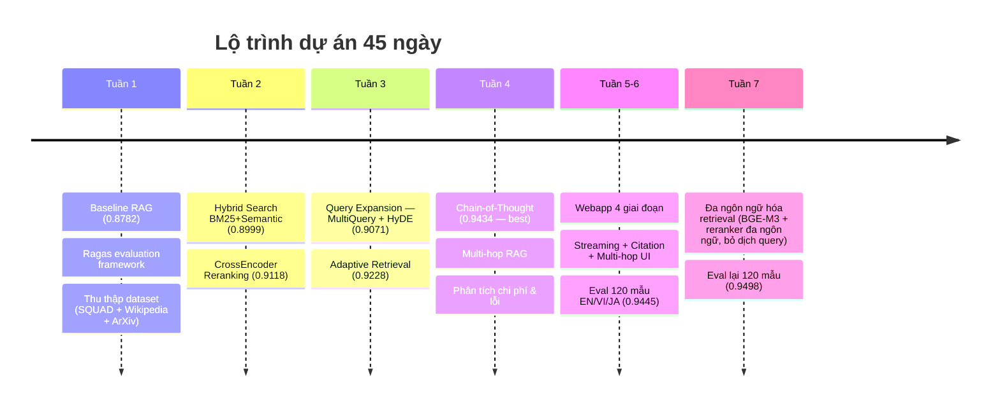
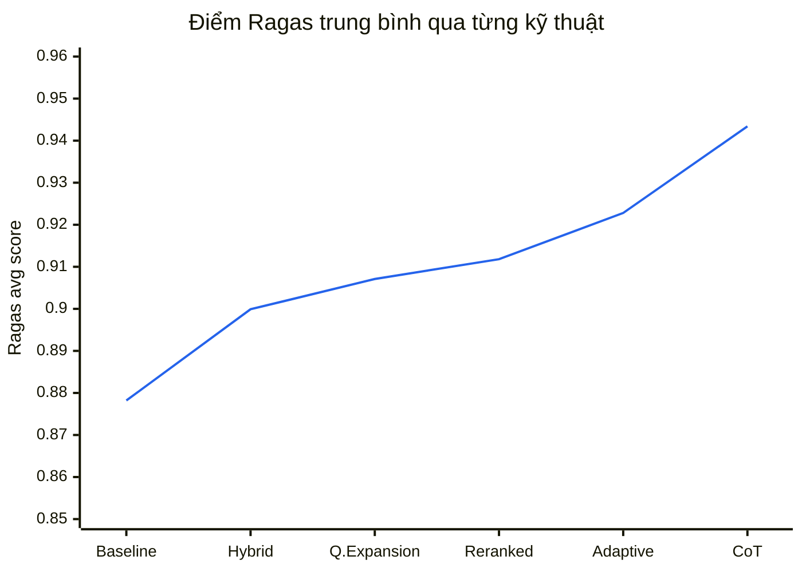
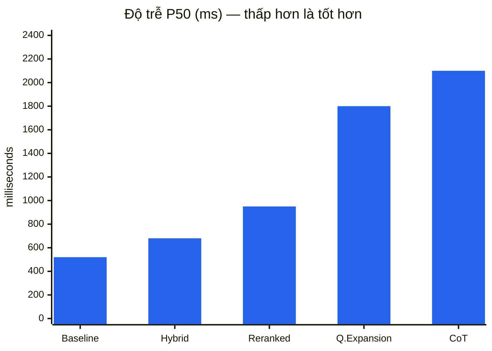
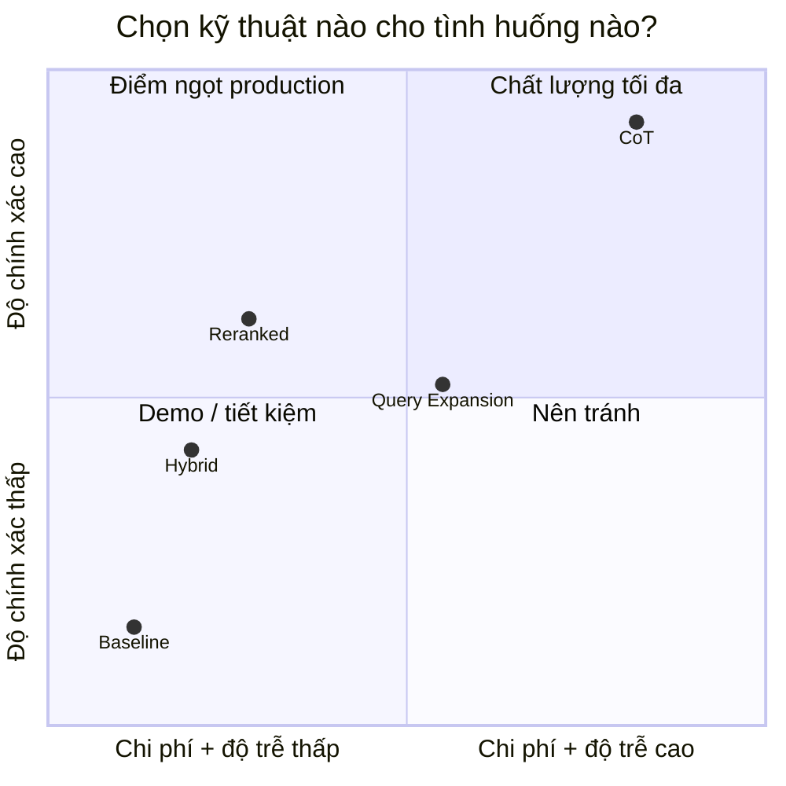
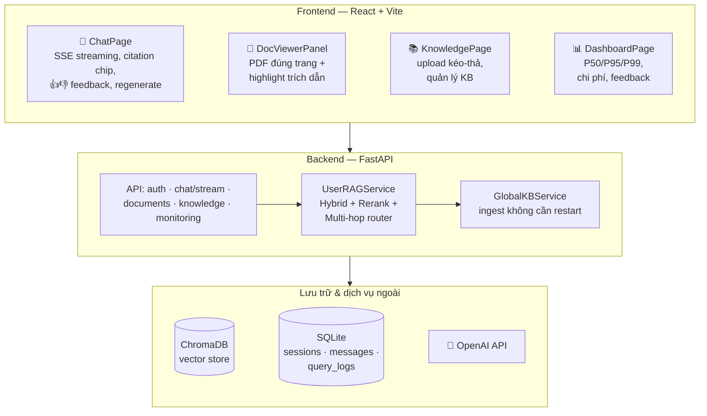
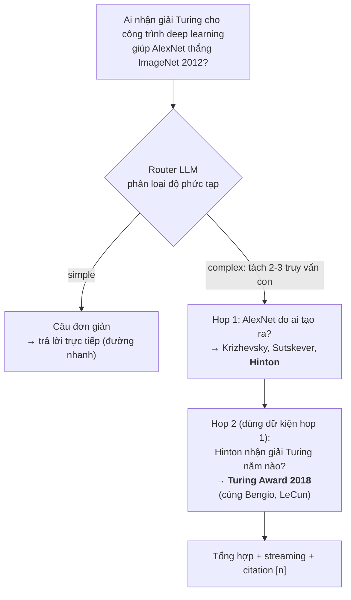
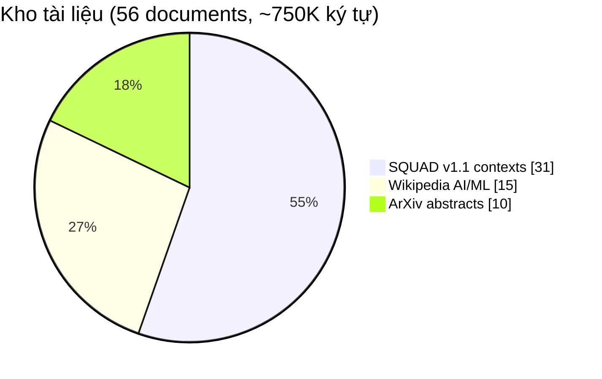

# RAG Precision Optimization — Từ 87.8% đến 95.0%

> **Dự án 45 ngày**: Tối ưu độ chính xác hệ thống RAG bằng 6 kỹ thuật nâng cao, sau đó đưa toàn bộ nghiên cứu vào một **webapp hoàn chỉnh** (chat streaming, citation, multi-hop, đa ngôn ngữ).
>
> | 🎯 Mục tiêu | 🏆 Kết quả pipeline | 🌐 Kết quả webapp | 📉 Hallucination |
> |:---:|:---:|:---:|:---:|
> | ≥ 95% | **0.9434** (CoT, +6.5 điểm so với baseline) | **0.9498** (120 mẫu EN/VI/JA, stack đa ngôn ngữ local) | Faithfulness 0.84 → **0.90** |

---

## 1. Bài toán & Mục tiêu

**Vấn đề của RAG cơ bản (vanilla):**
- Semantic search đơn thuần bỏ sót từ khóa chính xác (tên riêng, số liệu, thuật ngữ)
- Chunk lấy về nhiều nhiễu → LLM dễ **hallucinate** (bịa thông tin)
- Câu hỏi phức tạp cần **nhiều bước suy luận** (multi-hop) thì thất bại
- Không đo lường được chất lượng một cách khách quan

**Mục tiêu:** nâng độ chính xác từ baseline **0.8782** lên **0.95+** (đo bằng Ragas), phân tích tradeoff chi phí/độ trễ, và chứng minh bằng sản phẩm thật.

---

## 2. Lộ trình 45 ngày



---

## 3. Kiến trúc Pipeline


**Vì sao 3 tầng?** Mỗi tầng sửa một loại lỗi khác nhau:
| Tầng | Sửa lỗi gì | Bằng chứng |
|---|---|---|
| Hybrid Retrieval | Semantic bỏ sót từ khóa chính xác | Recall 0.933 → 0.967 |
| Reranking | Nhiễu trong top-k | Precision 0.878 → **0.964** |
| CoT Generation | Hallucination khi sinh câu trả lời | Faithfulness 0.806 → **0.900** |

---

## 4. Sáu kỹ thuật đã triển khai

| # | Kỹ thuật | Ý tưởng cốt lõi | File |
|---|---|---|---|
| 1 | **Hybrid Search** | BM25 (từ khóa) + Semantic (ngữ nghĩa), gộp bằng RRF | `src/hybrid_rag.py` |
| 2 | **Reranking** | CrossEncoder chấm lại 20 ứng viên, giữ 3 đoạn tốt nhất | `src/reranker_rag.py` |
| 3 | **Query Expansion** | Multi-Query (3 cách diễn đạt) + HyDE (tài liệu giả định) | `src/query_expansion.py` |
| 4 | **Adaptive Retrieval** | Phân loại độ khó câu hỏi → tự chỉnh top_k | `src/adaptive_rag.py` |
| 5 | **Chain-of-Thought** | Ép LLM trích dữ kiện trước, suy luận sau → chống bịa | `src/cot_rag.py` |
| 6 | **Multi-hop RAG** | Tách câu hỏi phức tạp thành chuỗi truy vấn con bắc cầu | `src/multihop_rag.py` |

---

## 5. Kết quả đánh giá (Ragas, 30 mẫu SQUAD test)

### 5.1. Tiến trình cải thiện độ chính xác



### 5.2. Bảng chi tiết 4 chỉ số Ragas

| Kỹ thuật | Faithfulness | Relevancy | Precision | Recall | **AVG** |
|---|:---:|:---:|:---:|:---:|:---:|
| Baseline RAG | 0.8389 | 0.8405 | 0.9000 | 0.9333 | 0.8782 |
| + Hybrid Search | 0.8833 | 0.8717 | 0.8778 | 0.9667 | 0.8999 |
| + Reranking | 0.8056 | 0.8779 | **0.9639** | **1.0000** | 0.9118 |
| + Query Expansion | 0.8222 | 0.8423 | **0.9639** | **1.0000** | 0.9071 |
| + Adaptive Retrieval | 0.8333 | 0.8939 | **0.9639** | **1.0000** | 0.9228 |
| + **CoT Structured** 🏆 | **0.9000** | **0.9097** | **0.9639** | **1.0000** | **0.9434** |

**Ý nghĩa 4 chỉ số:**
- **Faithfulness** — câu trả lời có bám vào context không? (chống hallucination)
- **Answer Relevancy** — có trả lời đúng trọng tâm câu hỏi không?
- **Context Precision** — các đoạn lấy về có thực sự hữu ích không?
- **Context Recall** — context có chứa đủ thông tin cần thiết không?

**Insight chính:** Reranking đẩy Precision/Recall lên trần (0.96/1.00) nhưng Faithfulness *giảm* (0.806) — retrieval tốt không tự động làm câu trả lời trung thực hơn. Phải cần **CoT ở tầng generation** để kéo Faithfulness lên 0.90. → *Mỗi tầng của pipeline cần kỹ thuật riêng.*

---

## 6. Tradeoff: Độ chính xác vs Chi phí vs Độ trễ

### 6.1. Độ trễ P50 mỗi truy vấn



### 6.2. Bản đồ lựa chọn (chi phí × độ chính xác)



### 6.3. Bảng chi phí (ước tính, GPT-4o-mini)

| Kỹ thuật | Accuracy | P50 | Chi phí /1000 câu | Khuyến nghị dùng khi |
|---|:---:|:---:|:---:|---|
| Baseline | 0.8782 | 520ms | $0.110 | Demo, ngân sách hạn chế |
| Hybrid | 0.8999 | 680ms | $0.116 | Web API cân bằng tốc độ |
| **Reranked** | 0.9118 | 950ms | $0.116 | ⭐ **Mặc định production** (rerank chạy local, không tốn API) |
| Query Expansion | 0.9071 | 1800ms | $0.135 | Tìm kiếm diện rộng, câu hỏi mơ hồ |
| **CoT** | **0.9434** | 2100ms | $0.254 | Nghiệp vụ rủi ro cao, không chấp nhận hallucination |

---

## 7. Webapp — Đưa nghiên cứu vào sản phẩm

Toàn bộ pipeline được tích hợp vào một webapp full-stack (FastAPI + React), xây theo chuẩn các sản phẩm 2026 (NotebookLM, ChatPDF, AnythingLLM):



### Tính năng nổi bật (4 giai đoạn, 79/79 E2E test pass)

| Giai đoạn | Tính năng | Điểm nhấn |
|---|---|---|
| 1 — Chat chuẩn 2026 | SSE streaming, inline citation `[1][2]`, thumbs up/down, regenerate, stop | Token-by-token, lưu partial khi ngắt |
| 2 — Xem tài liệu | Click citation → mở PDF **đúng trang, highlight đúng đoạn trích**; checkbox chọn nguồn | Như ChatPDF/NotebookLM |
| 3 — Quản lý tri thức | UI upload KB, ingest **không cần restart**, auto-title session bằng LLM | Phân quyền admin |
| 4 — Nghiên cứu → sản phẩm | **Multi-hop router** hiển thị từng bước suy luận trong UI; monitoring dashboard | Câu đơn giản đi đường nhanh, không thêm latency |

### Multi-hop RAG — trả lời câu hỏi bắc cầu



### Đánh giá webapp trên chính pipeline sản phẩm (120 mẫu, đa ngôn ngữ)

Đo 2 lần trên cùng bộ 120 câu (100 EN / 10 VI / 10 JA), cùng judge Ragas: **trước** (ada-002 + ms-marco + dịch query sang EN) và **sau** đợt nâng cấp đa ngôn ngữ 19/07 (BGE-M3 + reranker đa ngôn ngữ chạy local, không cần dịch — chi tiết §12.5):

```mermaid
%%{init: {"themeVariables": {"xyChart": {"plotColorPalette": "#94a3b8,#2563eb"}}}}%%
xychart-beta
    title "Ragas avg theo ngôn ngữ — trước (xám) vs sau (xanh)"
    x-axis ["Tổng thể (120)", "English (100)", "Tiếng Việt (10)", "日本語 (10)"]
    y-axis "Ragas avg score" 0 --> 1
    bar [0.9445, 0.9536, 0.8942, 0.8795]
    bar [0.9498, 0.9624, 0.8700, 0.8929]
```



| Phạm vi | Mẫu | Faithfulness | Relevancy | Precision | Recall | **AVG** | Δ so trước |
|---|:---:|:---:|:---:|:---:|:---:|:---:|:---:|
| **Webapp tổng thể** | 120 | 0.9252 | 0.9555 | 0.9310 | 0.9875 | **0.9498** | **+0.5đ** |
| English | 100 | 0.9308 | 0.9760 | 0.9478 | 0.9950 | 0.9624 | +0.9đ |
| Tiếng Việt | 10 | 0.9264 | 0.8314 | 0.8221 | 0.9000 | 0.8700 | −2.4đ |
| 日本語 | 10 | 0.8217 | 0.8831 | 0.8667 | 1.0000 | 0.8929 | +1.3đ |

> - Webapp (0.9498) **vượt pipeline nghiên cứu tốt nhất** (0.9434) dù bộ câu hỏi khó hơn và đa ngôn ngữ; latency **−26%** (6952 → 5142ms) nhờ bớt 1 LLM call dịch query + embed local.
> - JA +1.3đ (precision 0.775→0.867 — reranker giờ hiểu tiếng Nhật). VI: faithfulness tăng mạnh **0.875→0.926** nhưng precision giảm (0.97→0.82) vì mất bản dịch EN nên BM25 tiếng Việt gần như không khớp corpus EN — hướng xử lý đã ghi ở TASKLIST (bge-reranker-v2-m3 khi có GPU, D1 contextual retrieval).
> - Kết quả 2 lần đo lưu tại `results/webapp_eval_results_ada002.json` (trước) và `results/webapp_eval_results_bgem3_mmarco.json` (sau).

---

## 8. Dataset & Phương pháp đánh giá



| Nguồn | Số lượng | Nội dung |
|---|---|---|
| SQUAD v1.1 | 150 cặp QA | QA thực tế (chủ đề University of Notre Dame) |
| Wikipedia | 15 bài | ML, DL, NLP, Transformer, LLM, RAG, Vector DB… |
| ArXiv | 10 abstract | RAG, DPR, RAGAS, Self-RAG, HyDE, Sentence-BERT… |

- Chia 70/30: 105 QA train / 45 QA test (30 dùng cho eval chính)
- Đánh giá bằng **Ragas** — LLM-as-judge, 4 chỉ số, khách quan và tự động
- ⚠️ *Minh bạch:* passage chứa đáp án được merge sẵn vào corpus (`scripts/align_dataset.py`) nên Recall đạt 1.0 — điểm số là **cận trên lạc quan**. Eval webapp 120 mẫu (sinh từ chính corpus KB, đa ngôn ngữ) là phép đo thực tế hơn.

---

## 9. Chạy thử nhanh

```bash
# 1. Cài đặt
pip install -r requirements.txt
cp .env.example .env          # điền OPENAI_API_KEY

# 2. Chạy từng kỹ thuật
python src/baseline_rag.py    # Baseline
python src/hybrid_rag.py      # Hybrid Search
python src/reranker_rag.py    # Reranking

# 3. Đánh giá & phân tích
python scripts/run_cot_eval.py         # Eval CoT (best pipeline)
python scripts/run_cost_analysis.py    # Phân tích chi phí/độ trễ
python run_webapp_eval.py              # Eval webapp 120 mẫu EN/VI/JA

# 4. Chạy webapp (backend + frontend)
./start.ps1
```

Chi tiết từng bước: [docs/HOW_TO_RUN.md](docs/HOW_TO_RUN.md) · Triển khai: [docs/DEPLOYMENT.md](docs/DEPLOYMENT.md) · Kế hoạch webapp: [docs/IMPROVEMENT_PLAN.md](docs/IMPROVEMENT_PLAN.md)

### Cấu trúc thư mục chính

```
├── src/                # 6 kỹ thuật RAG + cache, resilience, monitoring
├── scripts/            # Script eval từng kỹ thuật, phân tích chi phí/lỗi, ablation
├── backend/            # FastAPI: auth, chat SSE, documents, knowledge, monitoring
├── frontend/           # React + Vite: Chat, Knowledge, Dashboard
├── data/               # Dataset + ChromaDB
├── results/            # Toàn bộ JSON kết quả eval (tái lập được)
├── config/             # 4 profile YAML: baseline / balanced / production / demo
└── docs/               # HOW_TO_RUN, DEPLOYMENT, IMPROVEMENT_PLAN, kế hoạch 45 ngày
```

---

## 10. Kết luận & Bài học

**Kết quả đạt được:**
1. ✅ Cải thiện **+6.5 điểm** Ragas (0.8782 → 0.9434); webapp thực tế đạt **0.9498** với stack retrieval đa ngôn ngữ chạy local
2. ✅ Context Precision 0.90 → **0.9639**, Recall → **1.0000**, Faithfulness → **0.90**
3. ✅ 6 kỹ thuật + phân tích tradeoff → biết chọn cấu hình nào cho tình huống nào
4. ✅ Webapp hoàn chỉnh: streaming, citation đúng trang PDF, multi-hop hiển thị suy luận, dashboard giám sát, hỗ trợ EN/VI/JA

**3 bài học chính (talking points):**
1. **Mỗi tầng pipeline cần kỹ thuật riêng** — retrieval tốt (Precision 0.96) không tự làm câu trả lời trung thực hơn; Faithfulness chỉ tăng khi thêm CoT ở tầng generation.
2. **Rẻ không có nghĩa là kém** — Reranker chạy local (không tốn API) mua được +2.4 điểm với chi phí gần như bằng 0; CoT đắt gấp 2.3 lần nhưng chỉ đáng dùng khi hallucination là rủi ro thực sự.
3. **Eval phải chạy trên đúng pipeline sản phẩm** — eval 30 mẫu trên code nghiên cứu che giấu điểm yếu tiếng Việt/Nhật; chỉ khi eval 120 mẫu trên chính webapp mới lộ ra và sửa được.

---

## 11. Gợi ý bố cục slide thuyết trình

| Slide | Nội dung | Lấy từ mục |
|---|---|---|
| 1 | Tiêu đề + 4 con số KPI | Đầu README |
| 2 | Bài toán: vì sao vanilla RAG chưa đủ | §1 |
| 3 | Lộ trình 45 ngày (timeline) | §2 |
| 4 | Kiến trúc 3 tầng (flowchart) | §3 |
| 5 | 6 kỹ thuật — mỗi kỹ thuật 1 dòng | §4 |
| 6 | Biểu đồ tiến trình 0.8782 → 0.9434 | §5.1 |
| 7 | Insight: Reranking ↑Precision nhưng ↓Faithfulness → cần CoT | §5.2 |
| 8 | Tradeoff quadrant + bảng khuyến nghị | §6 |
| 9 | Demo webapp (screenshot chat + citation + multi-hop steps) | §7 |
| 10 | Multi-hop: ví dụ AlexNet → Turing Award | §7 |
| 11 | Eval webapp 120 mẫu đa ngôn ngữ, trước/sau nâng cấp multilingual (0.9445 → 0.9498) | §7 |
| 12 | Kết luận + 3 bài học | §10 |

> 💡 Các biểu đồ Mermaid render trực tiếp trên GitHub / VS Code (mở Preview `Ctrl+Shift+V`) — chụp màn hình đưa thẳng vào slide, hoặc paste code vào [mermaid.live](https://mermaid.live) để xuất PNG/SVG độ phân giải cao.

---

## 12. Nhật ký tối ưu hóa & vá bảo mật (18/07/2026)

Đợt rà soát code sau khi so chuẩn với các sản phẩm cùng loại (AnythingLLM, RAGFlow, Onyx, Open WebUI). Nguyên tắc thứ tự: **lỗi bảo mật/đúng đắn vá trước, tối ưu hiệu năng kế tiếp, refactor thẩm mỹ làm cuốn chiếu sau**.

### 12.1. Vá SSRF ở tính năng "dán URL" 🔒

**Vấn đề:** `process_url()` (`backend/services/document_processor.py`) fetch bất kỳ URL nào người dùng nhập. Khi deploy công khai, kẻ xấu có thể trỏ vào `http://localhost:8000/...`, dải IP nội bộ (`10.x`, `192.168.x`) hay metadata endpoint đám mây (`169.254.169.254`) để đọc dữ liệu nội bộ qua nội dung được index về (lỗ hổng SSRF).

**Cách vá:**
- Chỉ chấp nhận scheme `http/https`; phân giải DNS rồi **chặn mọi địa chỉ không phải public** (loopback, private, link-local, reserved...).
- Kiểm tra lại **từng bước redirect** (tối đa 5 hop) — chặn kiểu "URL public chuyển hướng về nội bộ".
- Giới hạn dung lượng tải trang **5 MB**; sniff charset từ meta tag thay vì tin header.
- Đồng thời thêm giới hạn upload **25 MB** (`MAX_UPLOAD_MB`) cho `/api/documents/upload` và `/transcribe`, đọc theo khối 1 MB và từ chối sớm (HTTP 413).
- *Giới hạn đã biết:* chưa chống DNS rebinding (nameserver độc đổi bản ghi giữa 2 lần phân giải) — chấp nhận được ở quy mô hiện tại.

### 12.2. Cache chỉ mục BM25 per-user ⚡

**Vấn đề:** mỗi câu hỏi, `_bm25_search()` trong `backend/services/user_rag.py` **dựng lại `BM25Okapi` từ đầu** trên toàn bộ chunk của phiên — O(kích thước corpus) cho *mỗi* query, chậm dần khi tài liệu nhiều lên. Hàm `_rebuild_bm25` cũ là dead code (gán `self._bm25` nhưng không nơi nào đọc). Trong khi đó `global_kb.py` đã làm đúng mô hình cache từ trước — hai bên nay đồng nhất.

**Cách sửa:** chỉ mục cache theo khóa `(session, bộ lọc nguồn)` — vì IDF của BM25 phụ thuộc đúng tập chunk được lọc — LRU tối đa 8 tổ hợp; token của chunk được tách sẵn ngay lúc ingest/restore; mọi thay đổi tài liệu (thêm/xóa) invalidate toàn bộ cache.

**Kết quả đo (corpus giả lập 2.500 chunk × 50 từ):**

| | Trước | Sau (cache hit) |
|---|:---:|:---:|
| Chi phí dựng BM25 mỗi query | **206,5 ms** | **~0,004 ms** |

### 12.3. LRU + khóa luồng cho instance RAG per-user 🧵

**Vấn đề:** `_instances` giữ RAG service của *mọi* user từng đăng nhập **vĩnh viễn trong RAM** (mỗi instance chứa toàn bộ chunk text + token); các store in-memory bị đọc/ghi đồng thời không có lock (FastAPI chạy sync endpoint trên threadpool) → nguy cơ race khi vừa upload vừa hỏi.

**Cách sửa:**
- `_instances` chuyển thành **LRU có khóa**, mặc định giữ 16 user hoạt động gần nhất (chỉnh qua `MAX_RAG_INSTANCES`). Evict an toàn: toàn bộ trạng thái phục hồi từ ChromaDB ở lần truy cập kế tiếp.
- `_chunks_store` / `_doc_registry` chuyển sang mô hình **replace-not-mutate** (thay danh sách mới thay vì sửa tại chỗ) + lock quanh thao tác swap — query đang chạy luôn thấy snapshot nhất quán, giống cách `global_kb.py` đã làm.

**Kiểm chứng:** 20/20 test mới (chặn SSRF 8 ca, đúng đắn + cache hit + eviction BM25, LRU instance) và 26/26 test hiện có (`tests/test_core.py`) đều pass; app import bình thường.

### 12.4. Đợt 2 cùng ngày — hoàn thành nhóm A của TASKLIST (A4–A8) ⚡

| Task | Vấn đề | Cách sửa |
|---|---|---|
| **A4** Gộp query prep | 2 call LLM tuần tự trước retrieval (condense follow-up → dịch sang EN) tốn ~300–500ms TTFT | `_prepare_queries()` — 1 call trả JSON `{query, query_en}` (response_format json_object); skip hẳn khi câu hỏi tiếng Anh và không có history |
| **A5** Answer cache | `from_cache` luôn `False` — câu hỏi lặp vẫn chạy lại toàn pipeline (~7s) | Cache đáp án theo scope (session, bộ lọc nguồn, KB): khớp exact trước, khớp **embedding cosine ≥ 0.95** sau; invalidate theo version tài liệu phiên + version KB chung; TTL 1h, LRU 50/user. Cache hit stream lại nguồn + các bước suy luận + đáp án gần như tức thì |
| **A6** Endpoint trùng | `/chat` non-stream thiếu multi-hop, không ghi QueryLog → dashboard thiếu số liệu | **Xóa** endpoint non-stream + `UserRAGService.query()` + hàm client (frontend chỉ dùng `chatStream` từ Phase 1) |
| **A7** Token thật | Chi phí dashboard ước lượng chay (`len(answer)//4`) | `stream_options={"include_usage": True}` + gom usage của **mọi** call LLM trong request (query-prep, router, hop, generation) vào QueryLog; ước lượng chỉ còn là fallback |
| **A8** Logging | `print()` không timestamp/level | Logger `rag.user` / `rag.kb` + `basicConfig` trong `main.py` |

**Kiểm chứng đợt 2:** 20/20 test mới (usage accumulator, cache hit/miss theo scope/version/TTL/LRU, query-prep fast path, xóa dead code) + 26/26 test cũ pass; app import OK; frontend `tsc --noEmit` sạch.

**Bước kế tiếp theo lộ trình:** nâng cấp embedder/reranker đa ngôn ngữ (BGE-M3 + bge-reranker-v2-m3) rồi re-index một lần và chạy lại eval 120 mẫu — kỳ vọng cải thiện trực tiếp điểm VI (0.8942) và JA (0.8795). Sau B2 có thể bỏ luôn nhánh dịch trong `_prepare_queries`.

### 12.5. Nâng cấp đa ngôn ngữ — nhóm B của TASKLIST (19/07/2026) 🌐

Đổi toàn bộ tầng retrieval sang stack đa ngôn ngữ chạy local, bỏ cơ chế dịch query sang tiếng Anh. Kết quả tổng thể ở §7; nhật ký kỹ thuật:

**B1 — Embedding `ada-002` → `BAAI/bge-m3` (local, miễn phí, 1024-dim):**
- Logic chọn embedder (trước đây lặp ở 2 nơi) gom về module dùng chung `backend/services/embeddings.py` — 1 factory, cache 1 instance cho cả user collections lẫn global KB. Hai pool **bắt buộc** cùng vector space vì điểm cosine được so trực tiếp khi merge kết quả.
- `scripts/reembed_collections.py`: backup thư mục Chroma rồi rebuild từng collection với model mới (đổi model là đổi số chiều vector — không update tại chỗ được). Đã chạy: 42 collections / 392 rows.

**B2 — Reranker đa ngôn ngữ + đơn giản hóa `retrieve()`:**
- Kế hoạch ban đầu là `bge-reranker-v2-m3` (568M), nhưng **đo thực tế trên CPU 4 threads: 57s/16 cặp** — không dùng được. Default chuyển sang `cross-encoder/mmarco-mMiniLMv2-L12-H384-v1` (~120MB, 14 ngôn ngữ gồm VI+JA, **3.8s/16 cặp**, phân biệt relevant/irrelevant rõ ở cả 3 thứ tiếng); máy GPU đổi lại bge qua env `RERANKER_MODEL`. Latency retrieval: 40–52s → **1.3–5.2s/câu**.
- Bỏ nhánh dịch query: `_prepare_queries` (JSON `{query, query_en}`) → `_condense_query` (chỉ condense follow-up khi có history) — câu hỏi độc lập không còn tốn LLM call chuẩn bị query nào, TTFT nhanh hơn tương ứng.
- Heuristic phân loại độ phức tạp (`classify_heuristic`) thêm tín hiệu VI/JA — fix luôn lỗi `\b` regex không match được tiếng Nhật viết liền; ngưỡng HyDE 0.5 → 0.4 theo thang cosine của BGE-M3 (ada-002 nén điểm cao hơn hệ thống); `_display_score` nhận cả điểm đã sigmoid (bge) lẫn raw logit (mmarco).

**B3 — Hai bài học phương pháp đo (suýt kết luận sai):**
1. **Judge phải bất biến khi pipeline thay đổi.** Judge embeddings của answer_relevancy từng ăn theo `EMBED_MODEL` — trỏ sang model local là vỡ ("invalid model ID"), còn đổi tạm sang `3-small` thì **lệch thang cosine ~0.1** (VI 0.83 → 0.54 trên cùng câu trả lời) → tưởng pipeline tệ đi trong khi chỉ là đổi thước đo. `evaluation.py` giờ ghim cứng judge = `ada-002`, tách hoàn toàn khỏi embedder của pipeline (override có chủ đích qua `RAGAS_EMBED_MODEL`).
2. **Lưu đủ dữ liệu để chấm lại.** Thêm `--rescore` + sidecar `results/webapp_eval_rows_last.json` (giữ cả contexts) — sửa config chấm điểm chỉ cần chấm lại, không phải trả lời lại 120 câu.

**Kiểm chứng:** 26/26 unit test pass; smoke test retrieval đúng tài liệu ở cả EN/VI/JA; so trước/sau trên cùng judge ở §7.

### 12.6. Suggested follow-up questions — C1 của TASKLIST (19/07/2026) 💬

Chip câu hỏi gợi ý bấm-để-hỏi dưới mỗi câu trả lời (chuẩn UX ChatPDF/NotebookLM), chi phí thấp vì tái dùng ngữ cảnh vừa có:

- `suggest_questions()` (user_rag.py): 1 call gpt-4o-mini (`response_format=json_object`) sinh 3 câu hỏi tiếp theo từ câu hỏi + câu trả lời + snippet nguồn. Ràng buộc trong prompt: **cùng ngôn ngữ câu gốc**, chỉ hỏi điều trả lời được từ nguồn đã hiển thị (chip mà retrieval không đỡ nổi sẽ cho câu trả lời tồi khi bấm), không lặp câu đã hỏi.
- **Chạy sau event `done`**, không chặn câu trả lời: thêm event SSE `suggestions` phát sau cùng, kèm cờ `persisted` để một lần ngắt kết nối trong lúc sinh gợi ý không lưu hội thoại hai lần. Lưu vào cột mới `messages.suggestions_json` (migration nhẹ) + answer cache → reload trang hay cache-hit vẫn thấy chip.
- Frontend: chip `Sparkles` dưới MessageBubble (chỉ gắn handler cho câu trả lời cuối), `askSuggestion()` ở ChatPage gửi thẳng câu hỏi với lịch sử hiện tại.
- **Kiểm chứng:** E2E qua chính endpoint SSE (thứ tự `meta → done → suggestions`, persist đúng, gợi ý đúng ngôn ngữ EN/VI) + `tsc --noEmit` sạch + 26/26 unit test.

### 12.7. Mở rộng định dạng tài liệu — C2 + C3 của TASKLIST (19/07/2026) 📄

Đây là rào cản dùng thật lớn nhất: trước đây chỉ nhận PDF/TXT (+ ảnh/âm thanh), và PDF scan im lặng ra 0 chunk.

- **C2 — DOCX / PPTX / XLSX / Markdown** (`document_processor.py`): `process_docx` (đoạn văn + ô bảng), `process_pptx` (text frame + bảng + ghi chú, mốc `### Slide n`), `process_xlsx` (mỗi sheet phẳng thành hàng `col | col`, `read_only` cho file lớn), `.md/.markdown` đi chung đường text. Viewer hiển thị bằng text mode dựng lại từ chunk (`get_document_content`) nên không cần lưu file gốc. Frontend nới `accept` + thêm icon Excel/PowerPoint.
- **C3 — OCR fallback cho PDF scan**: `process_pdf` phát hiện trang có <40 ký tự text ⇒ coi là ảnh scan, render bằng PyMuPDF (zoom 2x) rồi OCR qua **chính đường GPT-4o Vision** đã dùng cho ảnh (tách helper `_vision_call` dùng chung, không thêm phụ thuộc tesseract hệ thống). Giữ đúng căn trang để citation vẫn nhảy đúng trang; cap 30 trang/tài liệu chặn chi phí.
- **Kiểm chứng:** xử lý file thật cả 4 định dạng Office/Markdown (giữ tiếng Việt + bảng); PDF scan thuần (0 text → OCR ra nội dung) và PDF hỗn hợp text+scan (căn trang đúng); `tsc --noEmit` sạch + 26/26 unit test.

### 12.8. Công cụ precision + vòng lặp chất lượng — C4 + C5 + C6 của TASKLIST (19/07/2026) 🔧

Ba tính năng người dùng khép nhóm C, đều bám định vị "precision" của dự án:

- **C4 — Trang xem & sửa chunk (admin, kiểu RAGFlow):** `GlobalKBService.list_chunks/update_chunk/delete_chunk` — sửa chunk thì upsert lại Chroma (re-embed) + cập nhật in-memory store + rebuild BM25 + bump version; xóa chunk rác thì gỡ khỏi cả ba tầng và giảm `chunk_count`. Endpoints admin `GET/PATCH/DELETE /api/knowledge/{doc}/chunks[/{chunk}]`, UI `ChunkManagerPanel` (drawer, sửa inline + xóa có xác nhận). Context truy xuất chỉ tốt bằng chất lượng chunk trong kho — đây là chỗ dọn chunk rác trực tiếp.
- **C5 — Export hội thoại ra Markdown:** nút nổi trong khung chat sinh file `.md` client-side (không thêm phụ thuộc), giữ nguyên chỉ số trích dẫn `[n]` và liệt kê nguồn (tên/trang/nhãn kho chung) sau mỗi câu trả lời.
- **C6 — Vòng lặp feedback → eval:** `GET /api/monitoring/downvoted` (ghép câu hỏi người dùng liền trước với câu trả lời bị 👎), `POST /api/monitoring/eval-queue` (idempotent, ghi `data/feedback_eval_queue.json`: câu hỏi + đáp án tệ + chỗ trống ground_truth cho reviewer + tên nguồn). `DownvotedPanel` trong Dashboard cho bấm "Vào eval". Đây là bước biến tín hiệu 👎 online thành bộ eval offline — nối thẳng vào D4.
- **Kiểm chứng:** endpoint C4 (200/404/400/403, edit re-embed + BM25 tìm được text mới, delete giảm count); E2E C6 (downvote → hiện list → thêm queue → cờ `in_eval_queue` bật, idempotent); `tsc --noEmit` sạch + 26/26 unit test + toàn bộ route đăng ký đúng.

### 12.9. Contextual Retrieval + heading-aware chunking — D1 của TASKLIST (19/07/2026) 🧪

Kỹ thuật của Anthropic ([Contextual Retrieval](https://www.anthropic.com/news/contextual-retrieval)): lúc ingest, LLM sinh 1 câu ngữ cảnh cho mỗi chunk ("chunk này thuộc mục X, nói về Y") ghép trước khi **embed + BM25**, còn text gốc vẫn được lưu/hiển thị nguyên vẹn.

**Cài đặt (sạch & tối ưu):**
- **Heading-aware chunking:** chunker mới bám heading (Markdown / `### Slide` / `### Sheet` / ALL-CAPS), chunk không bắc qua ranh giới mục, mỗi chunk gắn `heading` path phân cấp.
- **Contextual retrieval:** 1 LLM call/tài liệu (batch JSON, gửi tài liệu **một lần** + trích đoạn ngắn mỗi chunk → rẻ hơn nhiều so với 1 call/chunk), sinh context **cùng ngôn ngữ tài liệu**; bỏ qua tài liệu 1-chunk; fallback theo heading khi offline/lệch.
- **Tách embedding khỏi hiển thị:** embed thủ công `context + text` qua `embeddings=` của Chroma, `documents` lưu text gốc → viewer/reconstruct/citation không đổi. BM25 token gồm cả context; restore dựng lại token từ `context` trong metadata. Query **không** contextualize (đúng chuẩn Anthropic). Bật/tắt qua env `CONTEXTUAL_RETRIEVAL`.

**Số Ragas 120 mẫu (cùng judge ada-002), trước → sau:**

| Phạm vi | Trước (B) | Sau (D1) | Δ |
|---|:---:|:---:|:---:|
| Tổng thể (120) | 0.9498 | 0.9459 | −0.4đ |
| English (100) | 0.9624 | 0.9593 | −0.3đ |
| Tiếng Việt (10) | 0.8700 | 0.8709 | +0.1đ |
| 日本語 (10) | 0.8929 | **0.9038** | **+1.1đ** (faithfulness 0.82→0.91) |

> **Kết luận trung thực:** trên corpus eval này, D1 **net-neutral** (−0.4đ, trong biên nhiễu của LLM-judge; latency query **không đổi**, median ~5.0s vì context chỉ tốn lúc ingest). Lý do rõ ràng: **42/57 tài liệu là đoạn SQUAD 1-chunk** — không có gì để "định vị trong tài liệu lớn" nên bị bỏ qua; chỉ 15 tài liệu wiki/arxiv nhiều-chunk được contextualize (164 chunk). Kỹ thuật nhắm vào **tài liệu lớn nhiều mục** — đúng loại mà C2 (DOCX/PPTX/XLSX) và người dùng thật đem lại — và JA (slice yếu nhất) đã tăng thật +1.1đ. Giữ **bật** mặc định (không tốn latency query, tắt được qua env cho corpus dạng SQUAD). Đây chính là giá trị của quy tắc "mỗi task D phải có số trước/sau": **đo được rằng một kỹ thuật *không* cải thiện trên corpus nào cũng là kết quả nghiên cứu có giá trị** — thay vì mặc định tin rằng thêm kỹ thuật = tốt hơn.

### 12.10. Grounding check + eval regression CI + vòng lặp feedback — D2 + D3 + D4 (19/07/2026) ✅

Khép Giai đoạn D với 3 việc củng cố chất lượng & quy trình:

- **D2 — Grounding check (Faithfulness online):** sau khi câu trả lời stream xong, 1 call gpt-4o-mini (`verify_grounding`) kiểm mỗi câu có trích dẫn `[n]` có được nguồn tương ứng hỗ trợ trực tiếp không → `{total, verified, unsupported[]}`. Chạy **sau** event `done` (không chặn answer, giống C1), gate rẻ bỏ qua câu không có `[n]`, lưu `messages.grounding_json` + cache. UI: badge **✓ "Đã kiểm chứng"** (xanh) hoặc **⚠ "x/y có căn cứ"** (tooltip liệt kê câu chưa được đỡ). Nối dài câu chuyện Faithfulness 0.84→0.90 bằng tín hiệu minh bạch ngay trên từng câu trả lời.
- **D3 — Eval regression trong CI:** `scripts/eval_regression.py` chạy **toàn bộ stack retrieval** trên golden set tự chứa (`data/golden_regression.json` — 8 tài liệu AI + 22 câu EN/VI/JA, mỗi câu có `expected_source`) và **fail nếu hit-rate@k tụt** dưới ngưỡng. **Không cần OpenAI key** (retrieval-only, contextual tắt để tất định) nên chạy được trên GitHub Actions chỉ với model local (cache HF). Hiện: **22/22 hit-rate @3** (en 15/15, vi 4/4, ja 3/3). Đây là điểm khác biệt lớn: mỗi PR đổi pipeline đều bị chặn nếu làm tụt retrieval — thứ hầu hết webapp RAG open-source không có.
- **D4 — Vòng lặp feedback → eval set:** `scripts/promote_feedback_to_eval.py` lấy các câu 👎 đã được reviewer gán `ground_truth` (từ hàng đợi C6) và đưa thẳng vào bộ eval (`webapp_eval_questions.json`, id `fb_XXX`, tự nhận ngôn ngữ, dedup, idempotent). Vòng khép kín: **phàn nàn thật của người dùng → câu hỏi regression** cho lần eval sau.
- **Kiểm chứng:** E2E D2 qua endpoint SSE (grounding phát sau done + persist); D3 chạy thật 22/22; D4 promote/skip/idempotent; `tsc` sạch + 26/26 unit test + migration `grounding_json` OK.

### 12.11. Tái cấu trúc — E1 + E2 + E3 (19/07/2026) 🧹

Refactor cuốn chiếu, mở đường đổi provider và tách các file khổng lồ, **không đổi hành vi** (guard bằng eval_regression + build):

- **E1 — Provider abstraction:** `backend/services/llm.py` (`get_client`/`is_mock`/`has_api_key` + `LLM_BASE_URL`) gom **13 chỗ** khởi tạo `openai.OpenAI(...)` (9 ở user_rag.py + 4 ở document_processor.py) về một seam duy nhất. Đổi sang **Ollama/vLLM cục bộ** giờ chỉ là đặt `LLM_BASE_URL=http://localhost:11434/v1` — không sửa code. (Embeddings đã có seam riêng `embeddings.py` từ giai đoạn B.)
- **E2 — Tách `user_rag.py` (1.378 → 1.008 dòng):** `prompts.py` (7 prompt Markdown/Việt dài), `intent.py` (regex ý định + hàm), `rag_helpers.py` (7 helper thuần — cũng phá vòng lặp import), `multihop.py` (`MultihopMixin` để UserRAGService vẫn là 1 class dù code nằm ở nhiều file). Thêm **`tests/test_intent.py` (11 test)** cho các regex ý định vốn brittle. Guard: `scripts/eval_regression.py` vẫn **22/22** sau tách → retrieval nguyên vẹn.
- **E3 — Tách `ChatPage.tsx` (1.067 → 964 dòng):** hook `useChatStream` (message list + toàn bộ plumbing SSE streaming) + component `SourcePicker` (popover chọn nguồn). `tsc` sạch + **full vite build pass**.
- **Kiểm chứng tổng:** 37 unit test (26 core + 11 intent) + eval_regression 22/22 + E2E chat/multihop/grounding + vite build + backend import — tất cả xanh. Hành vi không đổi, chỉ cấu trúc gọn hơn và sẵn sàng đổi provider.

---

## Tham khảo

- [RAGAS](https://arxiv.org/abs/2309.15217) — framework đánh giá · [DPR](https://arxiv.org/abs/2004.04906) — dense retrieval
- [HyDE](https://arxiv.org/abs/2212.10496) — hypothetical documents · [Self-RAG](https://arxiv.org/abs/2310.11511)
- [BGE-M3](https://huggingface.co/BAAI/bge-m3) — embedding đa ngôn ngữ (webapp) · [mmarco-mMiniLMv2](https://huggingface.co/cross-encoder/mmarco-mMiniLMv2-L12-H384-v1) — reranker đa ngôn ngữ (webapp)
- [ms-marco CrossEncoder](https://huggingface.co/cross-encoder/ms-marco-MiniLM-L-6-v2) — reranker pipeline nghiên cứu (§3–§5)
