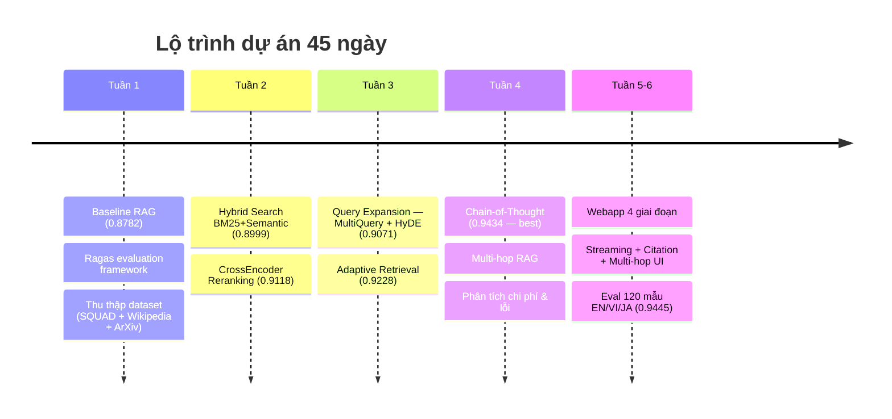
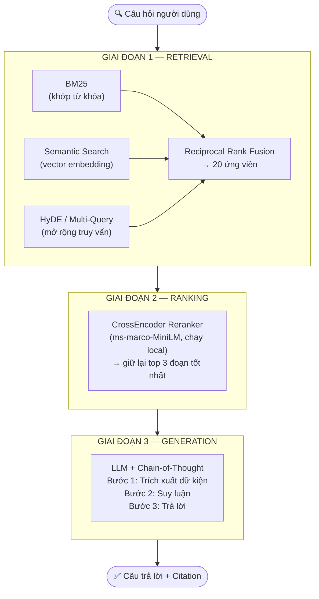
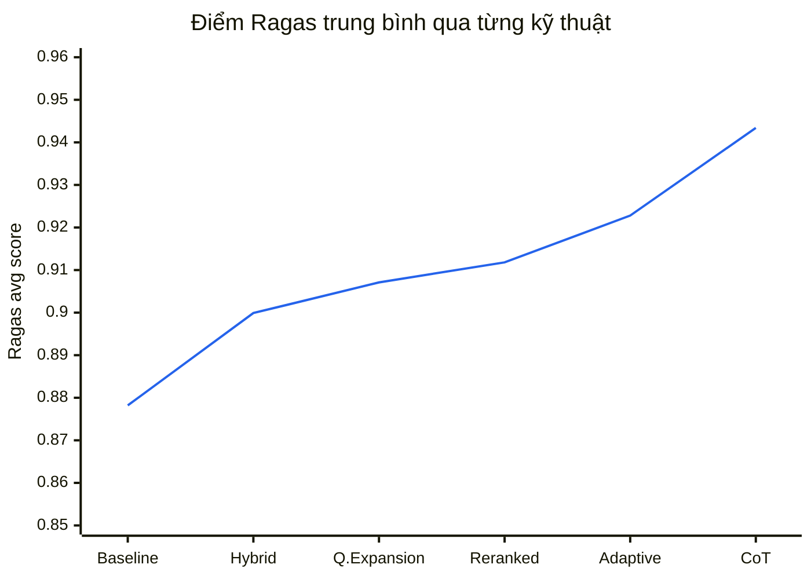
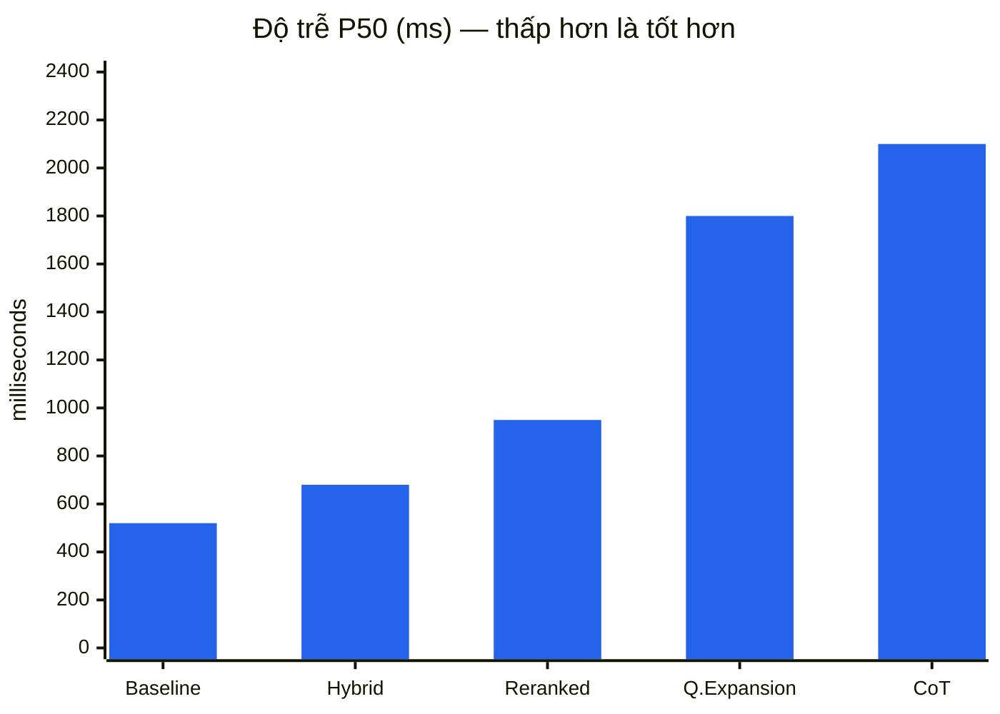
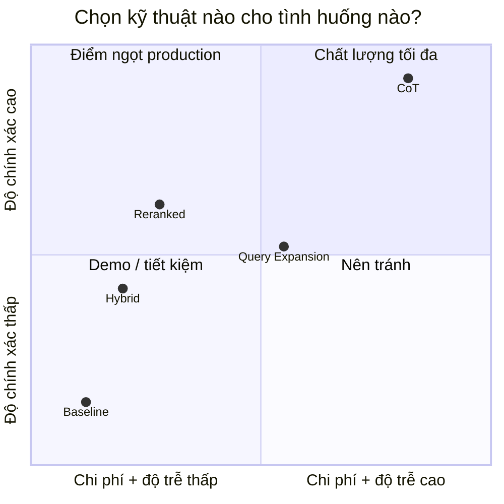
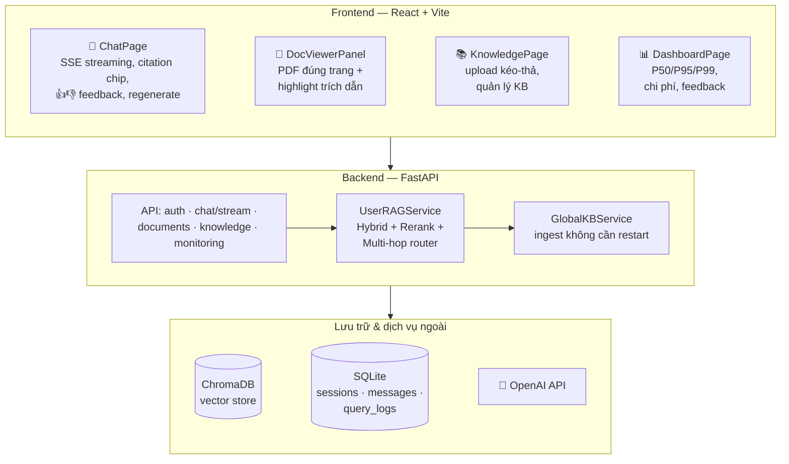
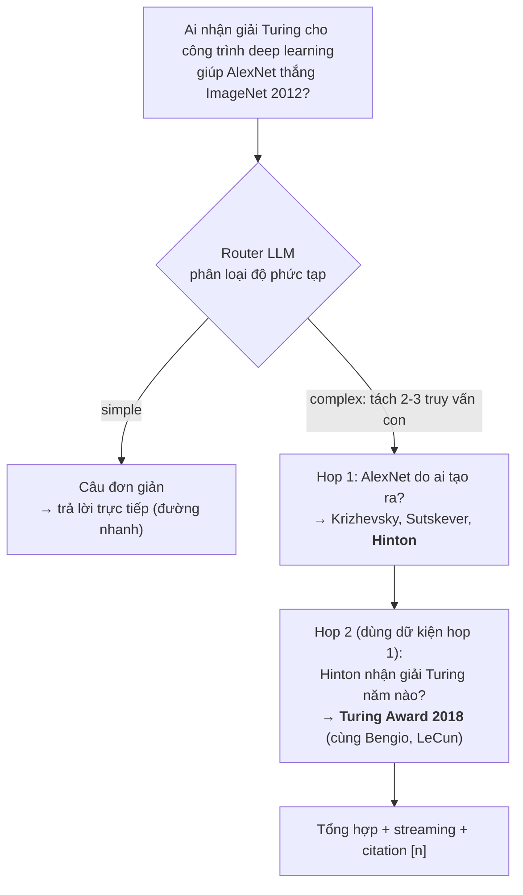
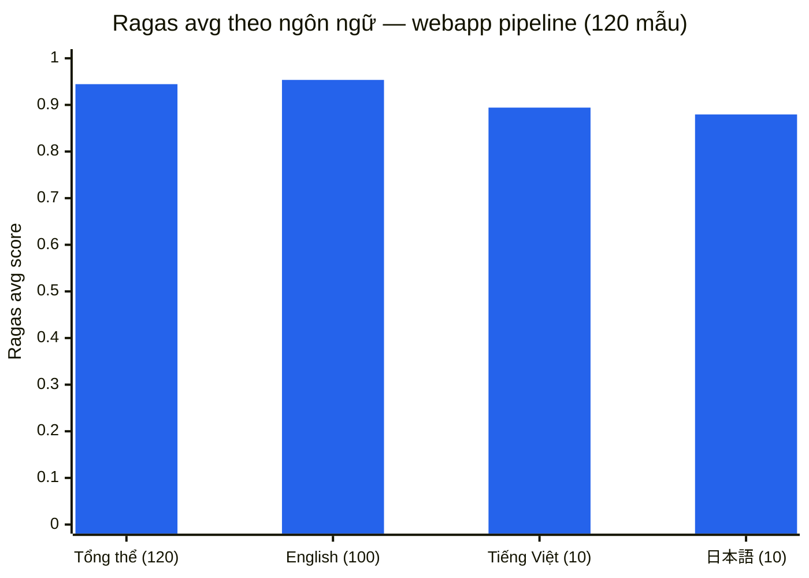
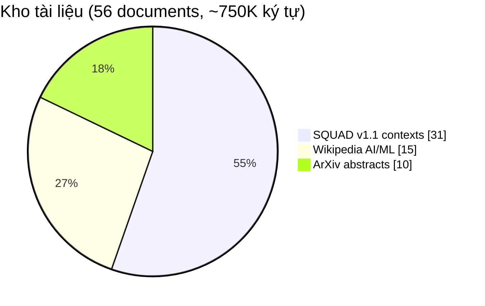

# RAG Precision Optimization — Từ 87.8% đến 94.5%

> **Dự án 45 ngày**: Tối ưu độ chính xác hệ thống RAG bằng 6 kỹ thuật nâng cao, sau đó đưa toàn bộ nghiên cứu vào một **webapp hoàn chỉnh** (chat streaming, citation, multi-hop, đa ngôn ngữ).
>
> | 🎯 Mục tiêu | 🏆 Kết quả pipeline | 🌐 Kết quả webapp | 📉 Hallucination |
> |:---:|:---:|:---:|:---:|
> | ≥ 95% | **0.9434** (CoT, +6.5 điểm so với baseline) | **0.9445** (120 mẫu EN/VI/JA) | Faithfulness 0.84 → **0.90** |

---

## 1. Bài toán & Mục tiêu

**Vấn đề của RAG cơ bản (vanilla):**
- Semantic search đơn thuần bỏ sót từ khóa chính xác (tên riêng, số liệu, thuật ngữ)
- Chunk lấy về nhiều nhiễu → LLM dễ **hallucinate** (bịa thông tin)
- Câu hỏi phức tạp cần **nhiều bước suy luận** (multi-hop) thì thất bại
- Không đo lường được chất lượng một cách khách quan

**Mục tiêu:** nâng độ chính xác từ baseline **0.8782** lên **0.95+** (đo bằng Ragas), phân tích tradeoff chi phí/độ trễ, và chứng minh bằng sản phẩm thật.

---

## 2. Lộ trình 45 ngày



---

## 3. Kiến trúc Pipeline



**Vì sao 3 tầng?** Mỗi tầng sửa một loại lỗi khác nhau:
| Tầng | Sửa lỗi gì | Bằng chứng |
|---|---|---|
| Hybrid Retrieval | Semantic bỏ sót từ khóa chính xác | Recall 0.933 → 0.967 |
| Reranking | Nhiễu trong top-k | Precision 0.878 → **0.964** |
| CoT Generation | Hallucination khi sinh câu trả lời | Faithfulness 0.806 → **0.900** |

---

## 4. Sáu kỹ thuật đã triển khai

| # | Kỹ thuật | Ý tưởng cốt lõi | File |
|---|---|---|---|
| 1 | **Hybrid Search** | BM25 (từ khóa) + Semantic (ngữ nghĩa), gộp bằng RRF | `src/hybrid_rag.py` |
| 2 | **Reranking** | CrossEncoder chấm lại 20 ứng viên, giữ 3 đoạn tốt nhất | `src/reranker_rag.py` |
| 3 | **Query Expansion** | Multi-Query (3 cách diễn đạt) + HyDE (tài liệu giả định) | `src/query_expansion.py` |
| 4 | **Adaptive Retrieval** | Phân loại độ khó câu hỏi → tự chỉnh top_k | `src/adaptive_rag.py` |
| 5 | **Chain-of-Thought** | Ép LLM trích dữ kiện trước, suy luận sau → chống bịa | `src/cot_rag.py` |
| 6 | **Multi-hop RAG** | Tách câu hỏi phức tạp thành chuỗi truy vấn con bắc cầu | `src/multihop_rag.py` |

---

## 5. Kết quả đánh giá (Ragas, 30 mẫu SQUAD test)

### 5.1. Tiến trình cải thiện độ chính xác



### 5.2. Bảng chi tiết 4 chỉ số Ragas

| Kỹ thuật | Faithfulness | Relevancy | Precision | Recall | **AVG** |
|---|:---:|:---:|:---:|:---:|:---:|
| Baseline RAG | 0.8389 | 0.8405 | 0.9000 | 0.9333 | 0.8782 |
| + Hybrid Search | 0.8833 | 0.8717 | 0.8778 | 0.9667 | 0.8999 |
| + Reranking | 0.8056 | 0.8779 | **0.9639** | **1.0000** | 0.9118 |
| + Query Expansion | 0.8222 | 0.8423 | **0.9639** | **1.0000** | 0.9071 |
| + Adaptive Retrieval | 0.8333 | 0.8939 | **0.9639** | **1.0000** | 0.9228 |
| + **CoT Structured** 🏆 | **0.9000** | **0.9097** | **0.9639** | **1.0000** | **0.9434** |

**Ý nghĩa 4 chỉ số:**
- **Faithfulness** — câu trả lời có bám vào context không? (chống hallucination)
- **Answer Relevancy** — có trả lời đúng trọng tâm câu hỏi không?
- **Context Precision** — các đoạn lấy về có thực sự hữu ích không?
- **Context Recall** — context có chứa đủ thông tin cần thiết không?

**Insight chính:** Reranking đẩy Precision/Recall lên trần (0.96/1.00) nhưng Faithfulness *giảm* (0.806) — retrieval tốt không tự động làm câu trả lời trung thực hơn. Phải cần **CoT ở tầng generation** để kéo Faithfulness lên 0.90. → *Mỗi tầng của pipeline cần kỹ thuật riêng.*

---

## 6. Tradeoff: Độ chính xác vs Chi phí vs Độ trễ

### 6.1. Độ trễ P50 mỗi truy vấn



### 6.2. Bản đồ lựa chọn (chi phí × độ chính xác)



### 6.3. Bảng chi phí (ước tính, GPT-4o-mini)

| Kỹ thuật | Accuracy | P50 | Chi phí /1000 câu | Khuyến nghị dùng khi |
|---|:---:|:---:|:---:|---|
| Baseline | 0.8782 | 520ms | $0.110 | Demo, ngân sách hạn chế |
| Hybrid | 0.8999 | 680ms | $0.116 | Web API cân bằng tốc độ |
| **Reranked** | 0.9118 | 950ms | $0.116 | ⭐ **Mặc định production** (rerank chạy local, không tốn API) |
| Query Expansion | 0.9071 | 1800ms | $0.135 | Tìm kiếm diện rộng, câu hỏi mơ hồ |
| **CoT** | **0.9434** | 2100ms | $0.254 | Nghiệp vụ rủi ro cao, không chấp nhận hallucination |

---

## 7. Webapp — Đưa nghiên cứu vào sản phẩm

Toàn bộ pipeline được tích hợp vào một webapp full-stack (FastAPI + React), xây theo chuẩn các sản phẩm 2026 (NotebookLM, ChatPDF, AnythingLLM):



### Tính năng nổi bật (4 giai đoạn, 79/79 E2E test pass)

| Giai đoạn | Tính năng | Điểm nhấn |
|---|---|---|
| 1 — Chat chuẩn 2026 | SSE streaming, inline citation `[1][2]`, thumbs up/down, regenerate, stop | Token-by-token, lưu partial khi ngắt |
| 2 — Xem tài liệu | Click citation → mở PDF **đúng trang, highlight đúng đoạn trích**; checkbox chọn nguồn | Như ChatPDF/NotebookLM |
| 3 — Quản lý tri thức | UI upload KB, ingest **không cần restart**, auto-title session bằng LLM | Phân quyền admin |
| 4 — Nghiên cứu → sản phẩm | **Multi-hop router** hiển thị từng bước suy luận trong UI; monitoring dashboard | Câu đơn giản đi đường nhanh, không thêm latency |

### Multi-hop RAG — trả lời câu hỏi bắc cầu



### Đánh giá webapp trên chính pipeline sản phẩm (120 mẫu, đa ngôn ngữ)



| Phạm vi | Mẫu | Faithfulness | Relevancy | Precision | Recall | **AVG** |
|---|:---:|:---:|:---:|:---:|:---:|:---:|
| **Webapp tổng thể** | 120 | 0.9154 | 0.9502 | 0.9290 | 0.9833 | **0.9445** |
| English | 100 | 0.9263 | 0.9672 | 0.9361 | 0.9850 | 0.9536 |
| Tiếng Việt | 10 | 0.8750 | 0.8318 | 0.9700 | 0.9000 | 0.8942 |
| 日本語 | 10 | 0.8533 | 0.8896 | 0.7750 | 1.0000 | 0.8795 |

> Webapp (0.9445) **vượt cả pipeline nghiên cứu tốt nhất** (0.9434) dù chạy trên bộ câu hỏi khó hơn và đa ngôn ngữ — nhờ cross-lingual fix cho câu VI/JA trên corpus EN.

---

## 8. Dataset & Phương pháp đánh giá



| Nguồn | Số lượng | Nội dung |
|---|---|---|
| SQUAD v1.1 | 150 cặp QA | QA thực tế (chủ đề University of Notre Dame) |
| Wikipedia | 15 bài | ML, DL, NLP, Transformer, LLM, RAG, Vector DB… |
| ArXiv | 10 abstract | RAG, DPR, RAGAS, Self-RAG, HyDE, Sentence-BERT… |

- Chia 70/30: 105 QA train / 45 QA test (30 dùng cho eval chính)
- Đánh giá bằng **Ragas** — LLM-as-judge, 4 chỉ số, khách quan và tự động
- ⚠️ *Minh bạch:* passage chứa đáp án được merge sẵn vào corpus (`scripts/align_dataset.py`) nên Recall đạt 1.0 — điểm số là **cận trên lạc quan**. Eval webapp 120 mẫu (sinh từ chính corpus KB, đa ngôn ngữ) là phép đo thực tế hơn.

---

## 9. Chạy thử nhanh

```bash
# 1. Cài đặt
pip install -r requirements.txt
cp .env.example .env          # điền OPENAI_API_KEY

# 2. Chạy từng kỹ thuật
python src/baseline_rag.py    # Baseline
python src/hybrid_rag.py      # Hybrid Search
python src/reranker_rag.py    # Reranking

# 3. Đánh giá & phân tích
python scripts/run_cot_eval.py         # Eval CoT (best pipeline)
python scripts/run_cost_analysis.py    # Phân tích chi phí/độ trễ
python run_webapp_eval.py              # Eval webapp 120 mẫu EN/VI/JA

# 4. Chạy webapp (backend + frontend)
./start.ps1
```

Chi tiết từng bước: [docs/HOW_TO_RUN.md](docs/HOW_TO_RUN.md) · Triển khai: [docs/DEPLOYMENT.md](docs/DEPLOYMENT.md) · Kế hoạch webapp: [docs/IMPROVEMENT_PLAN.md](docs/IMPROVEMENT_PLAN.md)

### Cấu trúc thư mục chính

```
├── src/                # 6 kỹ thuật RAG + cache, resilience, monitoring
├── scripts/            # Script eval từng kỹ thuật, phân tích chi phí/lỗi, ablation
├── backend/            # FastAPI: auth, chat SSE, documents, knowledge, monitoring
├── frontend/           # React + Vite: Chat, Knowledge, Dashboard
├── data/               # Dataset + ChromaDB
├── results/            # Toàn bộ JSON kết quả eval (tái lập được)
├── config/             # 4 profile YAML: baseline / balanced / production / demo
└── docs/               # HOW_TO_RUN, DEPLOYMENT, IMPROVEMENT_PLAN, kế hoạch 45 ngày
```

---

## 10. Kết luận & Bài học

**Kết quả đạt được:**
1. ✅ Cải thiện **+6.5 điểm** Ragas (0.8782 → 0.9434); webapp thực tế đạt **0.9445**
2. ✅ Context Precision 0.90 → **0.9639**, Recall → **1.0000**, Faithfulness → **0.90**
3. ✅ 6 kỹ thuật + phân tích tradeoff → biết chọn cấu hình nào cho tình huống nào
4. ✅ Webapp hoàn chỉnh: streaming, citation đúng trang PDF, multi-hop hiển thị suy luận, dashboard giám sát, hỗ trợ EN/VI/JA

**3 bài học chính (talking points):**
1. **Mỗi tầng pipeline cần kỹ thuật riêng** — retrieval tốt (Precision 0.96) không tự làm câu trả lời trung thực hơn; Faithfulness chỉ tăng khi thêm CoT ở tầng generation.
2. **Rẻ không có nghĩa là kém** — Reranker chạy local (không tốn API) mua được +2.4 điểm với chi phí gần như bằng 0; CoT đắt gấp 2.3 lần nhưng chỉ đáng dùng khi hallucination là rủi ro thực sự.
3. **Eval phải chạy trên đúng pipeline sản phẩm** — eval 30 mẫu trên code nghiên cứu che giấu điểm yếu tiếng Việt/Nhật; chỉ khi eval 120 mẫu trên chính webapp mới lộ ra và sửa được.

---

## 11. Gợi ý bố cục slide thuyết trình

| Slide | Nội dung | Lấy từ mục |
|---|---|---|
| 1 | Tiêu đề + 4 con số KPI | Đầu README |
| 2 | Bài toán: vì sao vanilla RAG chưa đủ | §1 |
| 3 | Lộ trình 45 ngày (timeline) | §2 |
| 4 | Kiến trúc 3 tầng (flowchart) | §3 |
| 5 | 6 kỹ thuật — mỗi kỹ thuật 1 dòng | §4 |
| 6 | Biểu đồ tiến trình 0.8782 → 0.9434 | §5.1 |
| 7 | Insight: Reranking ↑Precision nhưng ↓Faithfulness → cần CoT | §5.2 |
| 8 | Tradeoff quadrant + bảng khuyến nghị | §6 |
| 9 | Demo webapp (screenshot chat + citation + multi-hop steps) | §7 |
| 10 | Multi-hop: ví dụ AlexNet → Turing Award | §7 |
| 11 | Eval webapp 120 mẫu đa ngôn ngữ (0.9445) | §7 |
| 12 | Kết luận + 3 bài học | §10 |

> 💡 Các biểu đồ Mermaid render trực tiếp trên GitHub / VS Code (mở Preview `Ctrl+Shift+V`) — chụp màn hình đưa thẳng vào slide, hoặc paste code vào [mermaid.live](https://mermaid.live) để xuất PNG/SVG độ phân giải cao.

---

## 12. Nhật ký tối ưu hóa & vá bảo mật (18/07/2026)

Đợt rà soát code sau khi so chuẩn với các sản phẩm cùng loại (AnythingLLM, RAGFlow, Onyx, Open WebUI). Nguyên tắc thứ tự: **lỗi bảo mật/đúng đắn vá trước, tối ưu hiệu năng kế tiếp, refactor thẩm mỹ làm cuốn chiếu sau**.

### 12.1. Vá SSRF ở tính năng "dán URL" 🔒

**Vấn đề:** `process_url()` (`backend/services/document_processor.py`) fetch bất kỳ URL nào người dùng nhập. Khi deploy công khai, kẻ xấu có thể trỏ vào `http://localhost:8000/...`, dải IP nội bộ (`10.x`, `192.168.x`) hay metadata endpoint đám mây (`169.254.169.254`) để đọc dữ liệu nội bộ qua nội dung được index về (lỗ hổng SSRF).

**Cách vá:**
- Chỉ chấp nhận scheme `http/https`; phân giải DNS rồi **chặn mọi địa chỉ không phải public** (loopback, private, link-local, reserved...).
- Kiểm tra lại **từng bước redirect** (tối đa 5 hop) — chặn kiểu "URL public chuyển hướng về nội bộ".
- Giới hạn dung lượng tải trang **5 MB**; sniff charset từ meta tag thay vì tin header.
- Đồng thời thêm giới hạn upload **25 MB** (`MAX_UPLOAD_MB`) cho `/api/documents/upload` và `/transcribe`, đọc theo khối 1 MB và từ chối sớm (HTTP 413).
- *Giới hạn đã biết:* chưa chống DNS rebinding (nameserver độc đổi bản ghi giữa 2 lần phân giải) — chấp nhận được ở quy mô hiện tại.

### 12.2. Cache chỉ mục BM25 per-user ⚡

**Vấn đề:** mỗi câu hỏi, `_bm25_search()` trong `backend/services/user_rag.py` **dựng lại `BM25Okapi` từ đầu** trên toàn bộ chunk của phiên — O(kích thước corpus) cho *mỗi* query, chậm dần khi tài liệu nhiều lên. Hàm `_rebuild_bm25` cũ là dead code (gán `self._bm25` nhưng không nơi nào đọc). Trong khi đó `global_kb.py` đã làm đúng mô hình cache từ trước — hai bên nay đồng nhất.

**Cách sửa:** chỉ mục cache theo khóa `(session, bộ lọc nguồn)` — vì IDF của BM25 phụ thuộc đúng tập chunk được lọc — LRU tối đa 8 tổ hợp; token của chunk được tách sẵn ngay lúc ingest/restore; mọi thay đổi tài liệu (thêm/xóa) invalidate toàn bộ cache.

**Kết quả đo (corpus giả lập 2.500 chunk × 50 từ):**

| | Trước | Sau (cache hit) |
|---|:---:|:---:|
| Chi phí dựng BM25 mỗi query | **206,5 ms** | **~0,004 ms** |

### 12.3. LRU + khóa luồng cho instance RAG per-user 🧵

**Vấn đề:** `_instances` giữ RAG service của *mọi* user từng đăng nhập **vĩnh viễn trong RAM** (mỗi instance chứa toàn bộ chunk text + token); các store in-memory bị đọc/ghi đồng thời không có lock (FastAPI chạy sync endpoint trên threadpool) → nguy cơ race khi vừa upload vừa hỏi.

**Cách sửa:**
- `_instances` chuyển thành **LRU có khóa**, mặc định giữ 16 user hoạt động gần nhất (chỉnh qua `MAX_RAG_INSTANCES`). Evict an toàn: toàn bộ trạng thái phục hồi từ ChromaDB ở lần truy cập kế tiếp.
- `_chunks_store` / `_doc_registry` chuyển sang mô hình **replace-not-mutate** (thay danh sách mới thay vì sửa tại chỗ) + lock quanh thao tác swap — query đang chạy luôn thấy snapshot nhất quán, giống cách `global_kb.py` đã làm.

**Kiểm chứng:** 20/20 test mới (chặn SSRF 8 ca, đúng đắn + cache hit + eviction BM25, LRU instance) và 26/26 test hiện có (`tests/test_core.py`) đều pass; app import bình thường.

### 12.4. Đợt 2 cùng ngày — hoàn thành nhóm A của TASKLIST (A4–A8) ⚡

| Task | Vấn đề | Cách sửa |
|---|---|---|
| **A4** Gộp query prep | 2 call LLM tuần tự trước retrieval (condense follow-up → dịch sang EN) tốn ~300–500ms TTFT | `_prepare_queries()` — 1 call trả JSON `{query, query_en}` (response_format json_object); skip hẳn khi câu hỏi tiếng Anh và không có history |
| **A5** Answer cache | `from_cache` luôn `False` — câu hỏi lặp vẫn chạy lại toàn pipeline (~7s) | Cache đáp án theo scope (session, bộ lọc nguồn, KB): khớp exact trước, khớp **embedding cosine ≥ 0.95** sau; invalidate theo version tài liệu phiên + version KB chung; TTL 1h, LRU 50/user. Cache hit stream lại nguồn + các bước suy luận + đáp án gần như tức thì |
| **A6** Endpoint trùng | `/chat` non-stream thiếu multi-hop, không ghi QueryLog → dashboard thiếu số liệu | **Xóa** endpoint non-stream + `UserRAGService.query()` + hàm client (frontend chỉ dùng `chatStream` từ Phase 1) |
| **A7** Token thật | Chi phí dashboard ước lượng chay (`len(answer)//4`) | `stream_options={"include_usage": True}` + gom usage của **mọi** call LLM trong request (query-prep, router, hop, generation) vào QueryLog; ước lượng chỉ còn là fallback |
| **A8** Logging | `print()` không timestamp/level | Logger `rag.user` / `rag.kb` + `basicConfig` trong `main.py` |

**Kiểm chứng đợt 2:** 20/20 test mới (usage accumulator, cache hit/miss theo scope/version/TTL/LRU, query-prep fast path, xóa dead code) + 26/26 test cũ pass; app import OK; frontend `tsc --noEmit` sạch.

**Bước kế tiếp theo lộ trình:** nâng cấp embedder/reranker đa ngôn ngữ (BGE-M3 + bge-reranker-v2-m3) rồi re-index một lần và chạy lại eval 120 mẫu — kỳ vọng cải thiện trực tiếp điểm VI (0.8942) và JA (0.8795). Sau B2 có thể bỏ luôn nhánh dịch trong `_prepare_queries`.

---

## Tham khảo

- [RAGAS](https://arxiv.org/abs/2309.15217) — framework đánh giá · [DPR](https://arxiv.org/abs/2004.04906) — dense retrieval
- [HyDE](https://arxiv.org/abs/2212.10496) — hypothetical documents · [Self-RAG](https://arxiv.org/abs/2310.11511)
- [ms-marco CrossEncoder](https://huggingface.co/cross-encoder/ms-marco-MiniLM-L-6-v2) — reranker model
