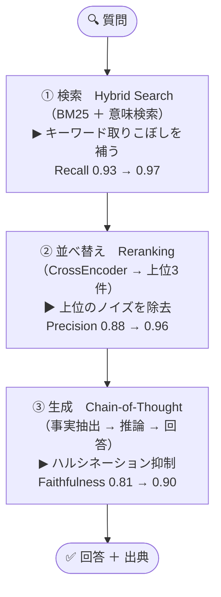
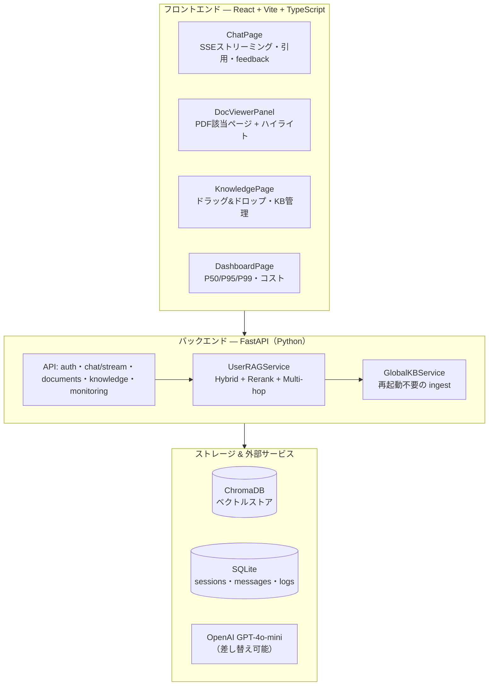

# 発表台本 — RAG精度最適化（生成AI研修テーマ：RAG系）

> **発表者:** レ・ティ・トゥイ・チャン ／ **日付:** 2026年7月28日 ／ **対象:** HBA・RikkeiSoft
> **全体30分:** 発表 ~15分 ＋ デモ ~8分 ＋ Q&A ~7分
> **スライド:** 日本語 ／ **台本:** 日本語（本番）＋ ベトナム語（練習用）
>
> 各スライド: 📊 = スライドに載せる文字 ／ 🎤JA = 話す内容（日本語）／ 🎤VI = 練習用（ベトナム語）

---

## 全体構成（15スライド）

| # | スライド | 目的 |
|---|---|---|
| 1 | 表紙 | タイトル・4 KPI |
| 2 | 研修テーマの理解 | 課題設定を相手の言葉で確認 |
| 3 | 課題（★） | 「近くないが関連する情報」＝核心 |
| 4 | アプローチ | 世界の手法を調査→テスト→最適化 |
| 5 | データ | 知識ベース・評価セット（学習はしない） |
| 6 | システム構成（全体像） | 3段階フロー＋使用モデル |
| 7 | なぜ3段階か | 各段階が別の誤りを直す ＋ **パイプライン図** |
| 8 | 実装した6つの技術 | 技術一覧 |
| 9 | Ragas評価と最適手法 | 技術ごと4指標→最適手法の導出 |
| 10 | 評価結果（実運用） | Webアプリ120問・レイテンシ・コスト |
| 11 | 技術スタック | webappの構成技術 ＋ **構成図** |
| 12 | デモ | 引用・Multi-hop・多言語 |
| 13 | 既存RAGとの比較 | NotebookLM/ChatPDF/AnythingLLM |
| 14 | 課題と今後の展望 | 正直な課題＋ロードマップ |
| 15 | まとめ | 3つの学び＋御礼 |

---

## Slide 1 — 表紙

**📊**
- RAG精度最適化 — 87.8%から95.0%へ
- 生成AI研修テーマ：RAG系
- 発表者：レ・ティ・トゥイ・チャン
- 2026年7月28日 — HBA・RikkeiSoft
- KPI：ベースライン 0.8782 → パイプライン 0.9434 → Webアプリ 0.9498

**🎤JA** 本日はお時間をいただき、ありがとうございます。生成AI研修のRAGテーマを担当いたしました、チャンと申します。本日は、いただいた研修テーマにどう取り組み、どのような成果が出たかを約15分でご報告し、その後デモとご質問の時間を設けております。プロジェクトは45日間で、RAGの精度をベースラインの87.8%から、最終的にWebアプリ上で94.98%まで引き上げました。

**🎤VI** Kính chào quý công ty, cảm ơn đã dành thời gian. Em là Trang, phụ trách chủ đề RAG. Hôm nay em báo cáo cách tiếp cận đề bài và kết quả trong ~15 phút, sau đó là demo và Q&A. Dự án 45 ngày, đã nâng độ chính xác RAG từ 87,8% lên 94,98% trên webapp thực tế.

---

## Slide 2 — 研修テーマの理解

**📊**
- RAGは生成AI活用で重要だが課題が多い技術
- RAGの仕組み（ご提示の定義）：質問に近い内容をDBから取得しプロンプトに乗せ回答
- 意味が近い断片しか拾えない
- つまり質問に意味が近くない情報は取得できない、という限界
- ［図：RAGの基本フロー］

**🎤JA** まず、いただいたテーマの理解を確認させてください。ご指摘の通り、RAGは重要ですが課題も多い技術です。基本は、質問に意味が近い内容をデータベースから取得し、プロンプトに乗せて回答を生成する、というもの。裏を返すと、意味が近い断片しか拾えない。つまり、質問と意味が近くない情報は取得できない、という構造的な限界があります。ここが今回のテーマの出発点だと理解しました。

**🎤VI** Trước tiên em xin xác nhận cách hiểu đề bài. Đúng như quý công ty nêu, RAG quan trọng nhưng nhiều thách thức. Cơ chế cơ bản: lấy nội dung gần nghĩa với câu hỏi từ DB, ghép vào prompt rồi sinh câu trả lời. Nghĩa là chỉ nhặt được mảnh gần ngữ nghĩa — thông tin không gần câu hỏi thì không lấy được. Đây là hạn chế cấu trúc, và là xuất phát điểm của đề bài.

---

## Slide 3 — 課題（このテーマの核心）

**📊**
- ★ 内容は近くないが、回答に関連する情報をどう拾えるようにするか
- 例：「DeepSeek-R1はOpenAIのどの推論モデルに匹敵し、そのモデルは回答前に何を生成するか」
- 答えの「思考の連鎖」は「DeepSeek-R1」と意味的に遠い
- 間にある"o1"を先に見つけないとたどり着けない
- 単純な意味検索（ベクトル検索）だけでは解けない

**🎤JA** 今回のテーマの核心は、この一点だと捉えました。「内容は近くないけれど、回答に関連する情報を、どうやって拾えるようにするか」。例えば「DeepSeek-R1はOpenAIのどの推論モデルに匹敵し、そのモデルは回答を出す前に何を生成するのか」。答えである「思考の連鎖」という語は、「DeepSeek-R1」とは意味的に離れています。間にある"o1"というモデルを先に見つけない限り、たどり着けません。単純なベクトル検索だけでは解けない——これが本テーマの核心です。

**🎤VI** Trọng tâm đề bài nằm ở đúng một điểm: làm sao lấy thông tin không gần nghĩa nhưng liên quan đến câu trả lời. Ví dụ: "DeepSeek-R1 sánh ngang mô hình suy luận nào của OpenAI, và mô hình đó sinh ra gì trước khi trả lời?". Đáp án cuối — "chuỗi suy luận" — nằm xa ngữ nghĩa so với "DeepSeek-R1". Chỉ khi tìm ra mắt xích trung gian "o1" trước, ta mới tới được đáp án. Vector search đơn thuần không giải được.

---

## Slide 4 — アプローチ（世界の手法を集め、検証し、最適化）

**📊**
- ご依頼通り、世の中のRAG技術を調査・収集
- 主要6技術を実装し、テストプログラム（評価基盤）を構築
- 共通指標Ragasで定量比較し、最適手法を導出
- 課題★には各段階で異なる技術を組み合わせて対応

**🎤JA** アプローチは、いただいたご依頼にそのまま沿っています。まず、世の中に存在するRAG技術を幅広く調査・収集しました。そのうえで主要な6つの技術を実装し、同じ土俵で比較できるテストプログラム、すなわち評価基盤を構築。評価にはRagasを用い、定量的に比較して最適な手法を導き出しています。結論を先に申し上げると、課題は一つの技術では解けず、検索・並べ替え・生成の各段階で異なる技術を組み合わせて対応しました。

**🎤VI** Cách tiếp cận bám đúng yêu cầu. Đầu tiên khảo sát và thu thập rộng các kỹ thuật RAG trên thế giới. Sau đó triển khai 6 kỹ thuật chính và xây một chương trình test — bộ khung đánh giá — để so sánh trên cùng mặt bằng, dùng Ragas so sánh định lượng và rút ra phương pháp tối ưu. Kết luận sớm: bài toán không giải được bằng một kỹ thuật, mà phải kết hợp kỹ thuật khác nhau ở từng công đoạn.

---

## Slide 5 — データ（知識ベースと評価セット）

**📊**
- 56ドキュメント、約75万文字
- SQUAD v1.1：150 QAペア
- Wikipedia：15記事（ML/DL/NLP/Transformer/LLM/RAG）
- ArXiv：10アブストラクト（RAG/DPR/RAGAS/HyDE）
- 70/30分割（105訓練/45テスト、30を評価に使用）
- ※モデル学習は行わず、評価と知識ベースに使用
- ［円グラフ：出典比率 31/15/10］

**🎤JA** 使用したデータです。知識ベースと評価用に、合計56ドキュメント、約75万文字を用意しました。SQUADから150のQAペア、Wikipediaの機械学習関連15記事、ArXivのアブストラクト10本。7対3に分けて評価しています。一点、正直に補足します。本プロジェクトはモデル自体の学習・ファインチューニングは行っておりません。データはあくまで評価と知識ベースのため。理由は次の構成でご説明します。

**🎤VI** Về dữ liệu: 56 tài liệu, ~750K ký tự làm kho tri thức và bộ đánh giá — 150 cặp QA từ SQUAD, 15 bài Wikipedia về ML, 10 abstract ArXiv, chia 7–3 để đánh giá. Xin nói thẳng: dự án không huấn luyện/fine-tune mô hình; dữ liệu chỉ để đánh giá và làm kho tri thức. Lý do em giải thích ở slide kiến trúc.

---

## Slide 6 — システム構成（全体像・学習済みモデルを活用）

**📊**
- データフロー：質問 → ①検索 → ②並べ替え → ③生成 → 回答＋出典
- 各段階で異なる技術を組み合わせる（詳細は次の3スライド）
- 使用モデル：埋め込み BGE-M3／Reranker mmarco（ローカル）／生成 GPT-4o-mini
- すべて学習済みモデル — 組み合わせ方で精度を出す（再学習なし・差し替え可能）

**🎤JA** システムの全体像です。処理は、質問を受けて、検索・並べ替え・生成という3つの段階を通り、最後に出典付きで回答します。それぞれの段階で異なる技術を組み合わせているのが特徴で、詳しくはこの後の3枚でご説明します。使用するモデルは、埋め込みにBGE-M3、並べ替えにmmarco——この2つはローカルで動きます——そして回答生成にGPT-4o-miniです。いずれも学習済みのモデルで、組み合わせ方によって精度を出しており、モデルの再学習は行っていません。

**🎤VI** Tổng quan hệ thống. Luồng xử lý: nhận câu hỏi → tìm kiếm → sắp xếp lại → sinh → trả lời kèm nguồn. Điểm đặc trưng là mỗi công đoạn kết hợp kỹ thuật khác nhau, chi tiết ở 3 slide tiếp theo. Model dùng: embedding BGE-M3, rerank mmarco (cả hai chạy cục bộ), và sinh câu trả lời bằng GPT-4o-mini. Tất cả là model có sẵn, tạo độ chính xác bằng cách phối hợp — không huấn luyện lại.

---

## Slide 7 — なぜ3段階のパイプラインなのか（2カラム：左=表／右=図）

**📊（左カラム）**
- 3段階に分けた理由：各段階が「別の種類の誤り」を直すから

| 段階 | 直す誤り | 証拠 |
|---|---|---|
| ① Hybrid検索 | 意味検索がキーワードを取りこぼす | Recall 0.933 → 0.967 |
| ② Reranking | 上位k件に混じるノイズ | Precision 0.878 → 0.964 |
| ③ CoT生成 | ハルシネーション（データ無しで創作） | Faithfulness 0.806 → 0.900 |

- 核心：検索を良くしても回答は自動的に誠実にならない → CoTが不可欠

**📊（右カラム＝パイプライン図。下のMermaidをPNG化して配置）**

**🎤JA** なぜパイプラインを3段階に分けたのか。理由は、各段階が「別の種類の誤り」を直すからです。第1段階の検索では、意味検索が固有名詞などのキーワードを取りこぼす誤りを、キーワード検索を足して直します——再現率が0.93から0.97へ。第2段階の並べ替えでは、上位に混じるノイズを除き、精度が0.88から0.96へ。第3段階の生成では、Chain-of-Thoughtが、データがないのに創作してしまうハルシネーションを抑え、忠実性が0.81から0.90へ改善します。ここが重要ですが、検索をいくら良くしても、回答が自動的に誠実になるわけではありません。ハルシネーションを防ぐには、生成段階のCoTが不可欠なのです。

**🎤VI** Vì sao chia pipeline thành 3 tầng? Vì mỗi tầng sửa một LOẠI lỗi khác nhau. Tầng 1 (tìm kiếm): thêm tìm theo từ khóa để không sót tên riêng — Recall 0,93 → 0,97. Tầng 2 (sắp xếp lại): loại nhiễu ở top đầu — Precision 0,88 → 0,96. Tầng 3 (sinh): Chain-of-Thought chặn hallucination — bịa khi không có dữ liệu — Faithfulness 0,81 → 0,90. Mấu chốt: tìm kiếm tốt đến mấy cũng KHÔNG tự làm câu trả lời trung thực. Muốn chống bịa, bắt buộc có CoT ở tầng sinh.

---

## Slide 8 — 実装した6つの技術

**📊**
- ① Hybrid Search：BM25（キーワード）＋意味検索、RRFで統合
- ② Reranking：CrossEncoderで20件を再採点、上位3件を厳選
- ③ Query Expansion：Multi-Query（3通りの言い換え）＋HyDE（仮の回答文）
- ④ Adaptive Retrieval：質問の難易度を判定しtop_kを自動調整
- ⑤ Chain-of-Thought：事実抽出→推論→回答の順で創作を防ぐ
- ⑥ Multi-hop：複雑な質問を橋渡しの部分質問に分解（例：DeepSeek-R1→o1→思考の連鎖）

**🎤JA** 実装した6つの技術を一覧でご紹介します。1つ目Hybrid Searchは、キーワード検索と意味検索をRRFで統合。2つ目Rerankingは、CrossEncoderで20件を再採点し上位3件を厳選。3つ目Query Expansionは、質問を3通りに言い換えるMulti-QueryとHyDE。4つ目Adaptive Retrievalは、質問の難易度を判定して取得件数を自動調整。5つ目Chain-of-Thoughtは、事実を抽出してから推論することで創作を防ぐ。6つ目Multi-hopは、複雑な質問を橋渡しの部分質問に分解します——先ほどの課題スライドのDeepSeekの例がこれにあたります。これら全てをテストプログラムで比較しました。

**🎤VI** 6 kỹ thuật đã triển khai: (1) Hybrid Search — gộp tìm từ khóa + ngữ nghĩa bằng RRF. (2) Reranking — CrossEncoder chấm lại 20 ứng viên, giữ 3 tốt nhất. (3) Query Expansion — Multi-Query (3 cách diễn đạt) + HyDE (câu trả lời giả định). (4) Adaptive Retrieval — đo độ khó câu hỏi, tự chỉnh số lượng lấy về. (5) Chain-of-Thought — trích dữ kiện trước, suy luận sau, chống bịa. (6) Multi-hop — tách câu hỏi phức tạp thành câu con bắc cầu, như ví dụ DeepSeek ở slide bài toán. Tất cả được so sánh bằng chương trình test.

---

## Slide 9 — Ragas評価：技術ごとの4指標と最適手法の導出

**📊**

| 技術 | 忠実性 | 関連性 | 精度 | 再現率 | 平均 |
|---|---|---|---|---|---|
| Baseline | 0.84 | 0.84 | 0.90 | 0.93 | 0.8782 |
| ＋Hybrid | 0.88 | 0.87 | 0.88 | 0.97 | 0.8999 |
| ＋Reranking | 0.81 | 0.88 | **0.96** | **1.00** | 0.9118 |
| ＋Query Exp | 0.82 | 0.84 | 0.96 | 1.00 | 0.9071 |
| ＋Adaptive | 0.83 | 0.89 | 0.96 | 1.00 | 0.9228 |
| ＋CoT 🏆 | **0.90** | **0.91** | 0.96 | 1.00 | **0.9434** |

- 重要な発見：Rerankingは精度・再現率を上限（0.96/1.00）まで上げるが、忠実性は下がる（0.81）
- → 検索改善だけでは「誠実さ」は得られない → CoTで忠実性0.90へ
- 最適手法：最高精度・ハルシネーション最小＝**CoT**／本番のコスト最適＝**Reranked**
- ［折れ線グラフ：0.8782→0.9434 の推移（README §5.1）］

**🎤JA** こちらが技術ごとのRagas4指標です。積み上げると平均は0.878から0.943へ。ここで最も重要な発見をお伝えします。並べ替え、Rerankingの行をご覧ください。精度は0.96、再現率は1.00と上限まで上がっています。ところが忠実性は0.81へ下がっているのです。つまり、検索を極限まで良くしても、回答の誠実さは自動的には得られない。最後にCoTを加えて初めて、忠実性が0.90まで戻ります。結論として、ハルシネーションを最小にする最高精度の構成はCoT、本番でコストと精度のバランスが最適なのはReranked、という使い分けになります。

**🎤VI** Đây là 4 chỉ số Ragas cho từng kỹ thuật. Cộng dồn, trung bình tăng 0,878 → 0,943. Phát hiện quan trọng nhất: nhìn dòng Reranking — Precision lên 0,96, Recall lên 1,00 (kịch trần). NHƯNG Faithfulness lại TỤT xuống 0,81. Nghĩa là tìm kiếm tốt đến cực hạn cũng không tự cho câu trả lời trung thực. Chỉ khi thêm CoT ở cuối, Faithfulness mới về 0,90. Kết luận: cấu hình chính xác nhất, bịa ít nhất là CoT; còn cân bằng chi phí–độ chính xác cho production là Reranked.

---

## Slide 10 — 評価結果（実運用：Webアプリ120問）

**📊**
- Webアプリ120問（EN/VI/JA）実運用評価：平均 **0.9498**（研究版0.9434を上回る）
- 言語別：EN 0.9624／JA 0.8929／VI 0.8700
- 検索ヒット率（回帰テスト）：**22/22**（OpenAIキー不要でCI実行）
- レイテンシP50：Baseline 520ms → Reranked 950ms → CoT 2100ms
- 推定コスト/1000問：Reranked $0.116 ／ CoT $0.254
- ハルシネーション（忠実性）0.84 → 0.90
- ［表：Ragas 4指標＋レイテンシ棒グラフ（README §5.2, §6.1）］

**🎤JA** 続いて、実運用に近い評価です。研究段階の30問ではなく、実際のWebアプリ上で英語・ベトナム語・日本語の120問を測りました。総合平均は0.9498で、研究段階の最高値0.9434を上回っています。言語別では英語0.96、日本語0.89、ベトナム語0.87です。さらに、検索精度が下がっていないかを毎回自動でチェックする回帰テストは、22問中22問すべて合格。これはOpenAIキーなしでCIで実行できます。レイテンシは推奨構成で約1秒、コストは1000問あたり0.12ドル程度です。

**🎤VI** Tiếp theo là đánh giá sát thực tế. Không phải 30 câu ở giai đoạn nghiên cứu, mà 120 câu Anh–Việt–Nhật trên chính webapp. Trung bình tổng 0,9498, vượt mức cao nhất giai đoạn nghiên cứu (0,9434). Theo ngôn ngữ: Anh 0,96; Nhật 0,89; Việt 0,87. Ngoài ra, test hồi quy tự kiểm tra retrieval mỗi lần đều đạt 22/22 — chạy được trên CI không cần OpenAI key. Độ trễ ở cấu hình khuyến nghị ~1 giây, chi phí ~0,12 đô/1000 câu.

---

## Slide 11 — このWebアプリを支える技術スタック（図付き）

**📊**
- フロントエンド：**React + Vite + TypeScript + TailwindCSS**（SSEストリーミング・PDFビューア・多言語i18n JA/VI/EN）
- バックエンド：**FastAPI（Python）**— auth・chat/stream・documents・knowledge・monitoring
- 検索・RAGコア：**BM25** ＋ 埋め込み **BGE-M3** ＋ Reranker **mmarco**（すべてローカル）
- ベクトルストア：**ChromaDB** ／ データDB：**SQLite**（sessions・messages・query_logs）
- 生成LLM：**OpenAI GPT-4o-mini**（provider seamで Ollama/vLLM に差し替え可能）

**📊（構成図。下のMermaidをPNG化して配置）**

**🎤JA** このWebアプリがどのような技術で構築されているかをご紹介します。フロントエンドはReactとVite、TypeScriptで、SSEによるストリーミング表示、PDFビューア、日本語・ベトナム語・英語の多言語対応を実装しています。バックエンドはPythonのFastAPIで、認証・チャット・ドキュメント・ナレッジ・監視のAPIを提供します。RAGの中核は、キーワード検索のBM25、多言語埋め込みのBGE-M3、並べ替えのmmarco——これらはすべてローカルで動きます。データはベクトルストアのChromaDBとSQLiteに保存し、回答生成にはOpenAIのGPT-4o-miniを使用。なお、この生成部分はprovider seamにより、社内のOllamaやvLLMへコード変更なしで差し替え可能です。

**🎤VI** Xin giới thiệu webapp này được xây dựng từ công nghệ gì. Frontend là React + Vite + TypeScript, hiện streaming qua SSE, trình xem PDF, và đa ngôn ngữ Nhật–Việt–Anh. Backend là FastAPI (Python), cung cấp API auth, chat, tài liệu, tri thức, giám sát. Lõi RAG gồm BM25 (tìm từ khóa), BGE-M3 (embedding đa ngôn ngữ), mmarco (sắp xếp lại) — tất cả chạy cục bộ. Dữ liệu lưu ở ChromaDB (vector) và SQLite. Sinh câu trả lời dùng OpenAI GPT-4o-mini — phần này có provider seam nên đổi sang Ollama/vLLM nội bộ không cần sửa code.

---

## Slide 12 — デモ（実際の動作）

**📊**
- チャット：トークン逐次表示 ＋ 引用[1][2]
- 引用クリック → PDFの該当ページを開き該当箇所をハイライト
- Multi-hop：DeepSeek-R1 → OpenAI o1 → 思考の連鎖（推論過程を表示）
- 多言語：日本語・ベトナム語で質問 → 同じ言語で回答
- ダッシュボード：レイテンシ、実コスト、低評価→評価キュー
- ［スクリーンショット：チャット＋引用＋Multi-hop steps］

**🎤JA** ここから実際の画面をお見せします。まず、回答が一語ずつ生成され、文中に出典番号が付きます。番号をクリックすると、元のPDFの該当ページが開き、根拠の箇所がハイライトされます。次に、本テーマの核心であるMulti-hopです。「DeepSeek-R1は性能面でOpenAIのどの推論モデルに匹敵し、そのモデルは最終的な回答を出す前に何を生成しますか」と入力します。するとシステムが自動で二つの検索ステップに分解し、推論の過程を表示します。ステップ1で"OpenAI o1"を見つけ、ステップ2でそのo1が「思考の連鎖」を生成する、と。まさに「意味は近くないが関連する情報」を拾えている実例です。最後に、日本語で質問すると日本語で答えます。

**🎤VI** Bây giờ em trình diễn màn hình thực tế. Câu trả lời hiện từng chữ, có gắn số trích dẫn; bấm vào số → PDF mở đúng trang, tô sáng đúng đoạn. Tiếp theo là Multi-hop — trọng tâm đề bài. Em nhập: "DeepSeek-R1 sánh ngang mô hình suy luận nào của OpenAI, và mô hình đó sinh ra gì trước khi trả lời?". Hệ thống tự tách 2 bước và hiển thị suy luận: Bước 1 tìm ra "OpenAI o1", Bước 2 tìm ra o1 sinh "chuỗi suy luận" trước khi trả lời — minh chứng lấy được "thông tin không gần nghĩa nhưng liên quan". Cuối cùng, hỏi tiếng Nhật trả lời tiếng Nhật.

> **デモ用マルチホップ質問（コピペ用）:**
> `DeepSeek-R1は性能面でOpenAIのどの推論モデルに匹敵し、そのモデルは最終的な回答を出す前に何を生成しますか？`
> 期待：ホップ1 → OpenAI o1 ／ ホップ2 → 思考の連鎖（long chains of thought）。**本番前に必ず一度テストすること。**

---

## Slide 13 — 既存RAGチャットボットとの比較

**📊**
- 調査対象：NotebookLM／ChatPDF／AnythingLLM
- 共通：出典表示、PDF閲覧、ドキュメントQA
- 差別化(1) Multi-hop推論を画面に可視化（★対応を明示）
- 差別化(2) 検索回帰テストをCI化（劣化を自動検知、OpenAIキー不要）
- 差別化(3) 多言語（JA/VI/EN）をローカルで、翻訳なし
- 姿勢：優れた点は取り入れ、足りない点を補った
- ［表：製品比較マトリクス］

**🎤JA** ご依頼にあった「世の中のRAGを調査する」点について、NotebookLM、ChatPDF、AnythingLLMと比較しました。出典表示やPDF閲覧といった基本機能は各製品も備えています。私たちはその良い点を取り入れたうえで、3つの差別化を加えました。1つ目、Multi-hopの推論過程を画面で見える化。2つ目、検索精度の劣化を自動検知する回帰テストをCIに組み込んだこと。3つ目、日本語・ベトナム語・英語を翻訳を挟まずローカルで扱えること。商用製品に勝ったと申し上げるつもりはありませんが、テーマに沿って必要な機能は押さえられたと考えています。

**🎤VI** Về yêu cầu "khảo sát RAG trên thế giới", em so với NotebookLM, ChatPDF, AnythingLLM. Chức năng cơ bản (hiện nguồn, xem PDF) họ đều có. Em tiếp thu điểm hay, và bổ sung 3 khác biệt: Một, trực quan hóa quá trình suy luận Multi-hop. Hai, tích hợp test hồi quy tự phát hiện tụt độ chính xác vào CI. Ba, xử lý Nhật–Việt–Anh ngay tại chỗ, không qua dịch. Em không dám nói vượt sản phẩm thương mại, nhưng tin đã đáp ứng đúng đề bài.

---

## Slide 14 — 課題と今後の展望

**📊**
- 課題(1) 多言語精度：翻訳を外すとVI精度が一部低下（0.97→0.82）
- 課題(2) ハードウェア：CPU4スレッドのため大型Rerankerは断念し軽量版を選択
- 課題(3) 評価の正直さ：一部データは答えを含むためRecall1.0は楽観的な上限
- 今後：GPUでRerankerを多言語ファインチューニング
- 今後：Google Drive/URL連携、Multi-hopの多段化

**🎤JA** 課題と今後の展望です。正直に3つ。1つ目、多言語の精度。翻訳処理を外したことで忠実性は上がりましたが、ベトナム語では検索精度が一部下がるトレードオフがありました。2つ目、ハードウェア。CPU4スレッドの環境のため、最も高精度な大型モデルは推論に57秒かかり断念し、軽量モデルを選びました。3つ目、評価の正直さ。一部の評価データは答えを含むため、再現率1.00はやや楽観的な上限値だと認識しています。今後は、GPU環境で並べ替えモデルを多言語向けにファインチューニングすること、Google DriveやURL連携、Multi-hopの多段化を計画しています。

**🎤VI** Thách thức và hướng phát triển — 3 điểm thẳng thắn. Một, độ chính xác đa ngôn ngữ: bỏ bước dịch thì trung thực tăng nhưng tiếng Việt tụt một phần (đánh đổi). Hai, phần cứng: CPU 4 luồng nên mô hình sắp xếp lớn nhất mất 57 giây, phải chọn bản nhẹ. Ba, tính trung thực của phép đo: một phần dữ liệu chứa sẵn đáp án nên Recall 1,00 chỉ là cận trên lạc quan. Hướng tới: fine-tune mô hình sắp xếp đa ngôn ngữ khi có GPU, tích hợp Google Drive/URL, mở rộng Multi-hop nhiều bước.

---

## Slide 15 — まとめ

**📊**
- 課題★にHybrid＋Query Expansion＋Multi-hopで対応
- 世界の手法を調査・実装し、テストプログラムで最適手法を導出
- 精度 0.8782 → 0.9498、ハルシネーション 0.84 → 0.90
- 学び：段階ごとに技術を使い分ける／安価でも効果は出る／評価は本番環境で
- ご清聴ありがとうございました — ご質問をお願いいたします

**🎤JA** まとめます。今回のテーマの核心「意味は近くないが関連する情報をどう拾うか」に対し、Hybrid Search、Query Expansion、Multi-hopの組み合わせで対応しました。ご依頼通り、世界の手法を調査・実装し、テストプログラムで最適な手法を導き出しています。結果として精度は87.8%から94.98%へ改善。学びは3点、各段階で技術を使い分けること、安価な手法でも効果は出ること、評価は本番環境で行うべきこと、です。ご清聴ありがとうございました。ご質問をお願いいたします。

**🎤VI** Tóm tắt: với trọng tâm "lấy thông tin không gần nghĩa nhưng liên quan", em giải bằng kết hợp Hybrid Search, Query Expansion, Multi-hop. Đúng yêu cầu, em khảo sát và triển khai kỹ thuật thế giới, dùng chương trình test rút ra phương pháp tối ưu. Kết quả 87,8% → 94,98%. Ba bài học: mỗi công đoạn cần kỹ thuật riêng; rẻ vẫn hiệu quả; đánh giá phải chạy trên môi trường sản phẩm thật. Xin cảm ơn quý vị — rất mong nhận câu hỏi.

---

# デモの流れ（8分）

事前準備：backend(:8000) と frontend(:5173) を起動済み・admin ログイン済み・KBに DeepSeek/LLM記事をingest済み・質問はメモ帳からコピペ。**バックアップ動画を用意。**

1. **通常質問＋引用（2分）** — 1問入力 → トークン逐次表示・引用[1][2] → 引用クリックでPDF該当ページ＋ハイライト。
2. **Multi-hop（2.5分）** — 上記のDeepSeek-R1→o1質問 → 「Reasoned across 2 search steps」で推論過程を表示。
3. **多言語＋根拠（2分）** — 日本語/ベトナム語で質問 → 同じ言語で回答。
4. **ダッシュボード（1.5分）** — P50/P95・実コスト・低評価→評価キュー。「ユーザーの不満→回帰テスト」で締める。

---

# 想定Q&A（日本語）

**Q. なぜモデルを学習させないのですか？**
RAGは知識を検索側に置く設計で、モデルに知識を詰め込むと更新のたびに再学習が必要になり、ハルシネーションも増えます。今回はCPU環境かつデータ150件のため学習は過学習を招き非現実的でした。学習が有効なのは検索モデルの多言語ファインチューニングで、GPUがあれば次の一手として計画しています。

**Q. Recall 1.00 は高すぎませんか？**
ご指摘の通りです。30問評価では答えを含む文書を知識ベースに入れているため、1.00は楽観的な上限値です。そのため実際のWebアプリで生成した120問でも測り直し、こちらを実力に近い数値と考えています。

**Q. Ragasという自動評価は信頼できますか？**
RagasはLLMを審査員に使う自動評価です。パイプラインを変えても評価がブレないよう、審査用モデルはada-002に固定しています。一度、審査モデルを変えたら数値が0.1ずれ誤った結論を出しかけたため、この分離を徹底しました。

**Q. 日本語の精度はどの程度ですか？**
日本語120問中10問で平均0.8929、多言語対応後に忠実性が0.82から0.91へ改善しました。並べ替えモデルが日本語を理解できるようになった効果です。さらなる向上にはGPUでの日本語ファインチューニングが有効と見ています。

**Q. 実運用のコストと速度は？**
推奨構成のRerankedは並べ替えがローカルで動くため1000問あたり約0.12ドル、P50レイテンシは約1秒。最高精度のCoTは約0.25ドル、2秒程度で高リスク業務向けです。用途で使い分けられます。

**Q. 商用製品を使えばよいのでは？**
基本機能は商用でも十分です。ただ今回のテーマ「意味は近くないが関連する情報の取得」を推論過程まで見える形で扱う点、検索劣化を自動検知するCI、翻訳なしの多言語ローカル処理は、既存製品にはない差別化だと考えています。

---

# スライド作成メモ（ビルド手順）

**時間配分:** 発表~15分（1枚あたり約1分、図中心のSlide 7/11は速く）＋ デモ~8分 ＋ Q&A~7分。

**Mermaid図のPNG化:** Slide 7（パイプライン図）と Slide 11（技術スタック図）は本ファイルのMermaidコードを [mermaid.live](https://mermaid.live) に貼り付け → Export PNG（高解像度）→ Canvaに配置。

**その他の図（READMEから）:** VS Codeで `README.md` を開き `Ctrl+Shift+V` プレビュー → 該当図をスクリーンショット、または mermaid.live で再出力。
- Slide 5 円グラフ（出典比率）… README §8
- Slide 9 折れ線（0.8782→0.9434）… README §5.1
- Slide 10 Ragas表・レイテンシ棒グラフ … README §5.2, §6.1

**表はCanvaのTable要素で:** Slide 7・9・10・13 の表はテキスト箇条書きより Canva の Table（Elements → Tables）が読みやすい。

**スクリーンショット:** Slide 12 のチャット＋引用＋Multi-hop はwebappから実際にキャプチャ（`localhost:5173`）。

**［  ］の穴埋め:** ロゴ・連絡先など。数値は本ファイルが正。
